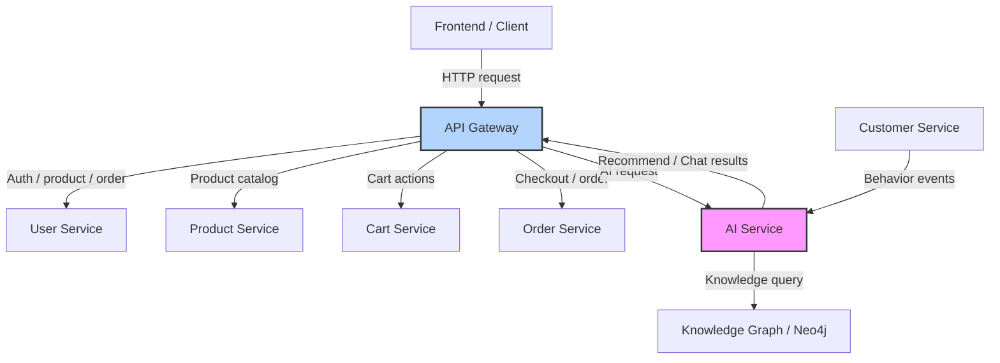
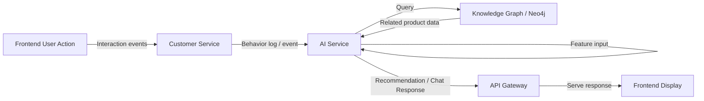

# CHƯƠNG 2: PHÁT TRIỂN HỆ E-COMMERCE MICROSERVICES

## 2.1 Xác định yêu cầu

Để xây dựng một nền tảng thương mại điện tử (E-Commerce) hiện đại, đáp ứng được lượng truy cập lớn và sự đa dạng về mặt hàng, việc xác định rõ các yêu cầu hệ thống ngay từ giai đoạn đầu là vô cùng thiết yếu. Yêu cầu của hệ thống được chia làm hai nhóm chính: Yêu cầu chức năng (Functional Requirements) và Yêu cầu phi chức năng (Non-functional Requirements).

### 2.1.1 Functional Requirements

Yêu cầu chức năng mô tả cụ thể những hành động, tính năng mà hệ thống phải thực hiện để phục vụ quy trình kinh doanh. Đối với nền tảng E-commerce này, các tính năng cốt lõi bao gồm:

- **Quản lý sản phẩm (Đa domain):** Hệ thống không chỉ bán một loại hàng hóa đơn điệu mà phải hỗ trợ nhiều nhóm sản phẩm (domain) khác nhau như Sách (Book), Đồ điện tử (Electronics), và Thời trang (Fashion). Mỗi nhóm có các thuộc tính đặc thù riêng biệt (ví dụ: sách có ISBN, quần áo có kích cỡ, màu sắc), đòi hỏi mô hình dữ liệu phải có tính kế thừa và mở rộng cao.
- **Quản lý người dùng và Phân quyền (RBAC):** Cung cấp cơ chế quản lý danh tính cho ba nhóm đối tượng chính: Admin (Quản trị viên toàn quyền), Staff (Nhân viên vận hành, quản lý kho/đơn hàng) và Customer (Khách hàng mua sắm).
- **Quản lý Giỏ hàng (Cart):** Cho phép người dùng duyệt web, thêm bớt sản phẩm, và thay đổi số lượng mua một cách linh hoạt. Dữ liệu giỏ hàng cần được lưu trữ tạm thời nhưng phải đảm bảo không bị mất khi người dùng tải lại trang.
- **Quy trình Đặt hàng (Order):** Xử lý việc chuyển đổi từ giỏ hàng (Cart) thành một Đơn đặt hàng (Order) chính thức, đồng thời chốt giá trị thanh toán và ghi nhận thông tin mua hàng.
- **Thanh toán (Payment):** Hệ thống cần có một luồng xử lý các giao dịch tài chính độc lập, theo dõi trạng thái thanh toán (đang chờ xử lý, thành công, hoặc thất bại) để đưa ra quyết định xử lý đơn hàng tiếp theo.
- **Giao hàng (Shipping):** Chịu trách nhiệm theo dõi lộ trình của đơn hàng từ kho lưu trữ đến tay người dùng cuối, cập nhật các trạng thái như Đang xử lý, Đang giao, Đã giao thành công.
- **Tìm kiếm và Gợi ý sản phẩm:** Cung cấp chức năng tìm kiếm thông tin nhanh chóng dựa trên từ khóa, danh mục. (Trong tương lai có thể tích hợp AI Service để phân tích hành vi người dùng và đưa ra gợi ý).

### 2.1.2 Non-functional Requirements

Đây là các tiêu chí đánh giá chất lượng và hiệu năng của kiến trúc hệ thống:

- **Khả năng mở rộng (Scalability):** Hệ thống phải có khả năng mở rộng (scale) theo chiều ngang cho từng dịch vụ riêng biệt. Trong các sự kiện Flash Sale, lượng người truy cập đặt hàng và thanh toán sẽ tăng đột biến, hệ thống phải cho phép nhân bản riêng order-service và payment-service mà không cần lãng phí tài nguyên để nhân bản product-service.
- **Tính sẵn sàng cao (High Availability):** Ứng dụng kiến trúc phân tán và đóng gói bằng Docker Container giúp cô lập lỗi (Fault Isolation). Nếu dịch vụ Giao hàng bị sập, người dùng vẫn có thể xem sản phẩm và thêm vào giỏ hàng bình thường, đảm bảo uptime của hệ thống ở mức tối đa.
- **Bảo mật (Security):** Toàn bộ giao tiếp giữa Client và Server được xác thực thông qua cơ chế phi trạng thái JWT (JSON Web Token). Mỗi Microservice sẽ không cần lưu trữ session của người dùng mà tự động xác minh quyền hạn thông qua chữ ký của Token, ngăn ngừa các cuộc tấn công giả mạo (CSRF).
- **Tính khả trì (Maintainability):** Codebase của toàn bộ dự án phải được phân rã rõ ràng theo nguyên tắc thiết kế hướng miền (DDD), giúp các nhóm phát triển (developer teams) có thể bảo trì, nâng cấp, hoặc thậm chí viết lại một service bằng ngôn ngữ khác mà không làm gián đoạn toàn bộ hệ thống.

## 2.2 Phân rã hệ thống theo DDD

Kiến trúc Microservices chỉ thực sự phát huy sức mạnh khi hệ thống được chia cắt đúng ranh giới nghiệp vụ. Nếu chia sai, các service sẽ phụ thuộc lẫn nhau quá nhiều (Tight Coupling), dẫn đến thảm họa "Distributed Monolith" (Kiến trúc nguyên khối phân tán). Do đó, Domain-Driven Design (DDD) được áp dụng làm phương pháp luận cốt lõi.

### 2.2.1 Bounded Context

Quá trình phân tích Event Storming và Ubiquitous Language đã giúp chúng ta chia hệ thống E-commerce thành 6 Bounded Context, ánh xạ 1-1 thành 6 Microservices độc lập:

1. **User Context (user-service):** Chứa đựng mọi quy tắc nghiệp vụ liên quan đến danh tính, bảo mật và phân quyền tài khoản.
2. **Product Context (product-service):** Nơi duy nhất hiểu về sự phức tạp của các loại mặt hàng, giá cả, và số lượng tồn kho.
3. **Cart Context (cart-service):** Ngữ cảnh quản lý trạng thái mua sắm tạm thời của khách hàng.
4. **Order Context (order-service):** Quản lý vòng đời của một đơn hàng, là trung tâm điều phối (Orchestrator) kết nối giỏ hàng, thanh toán và giao nhận.
5. **Payment Context (payment-service):** Ngữ cảnh độc quyền xử lý dòng tiền, liên kết với các cổng thanh toán bên thứ ba.
6. **Shipping Context (shipping-service):** Trách nhiệm duy nhất là điều phối logistics và cập nhật vận đơn.

### 2.2.2 Nguyên tắc

- **Database-per-Service (Mỗi ngữ cảnh một cơ sở dữ liệu riêng):** Đây là quy tắc tối thượng trong Microservices. Tuyệt đối không có chuyện order-service query trực tiếp vào bảng product của product-service. Nếu cần thông tin, nó phải gọi qua API. Việc này đảm bảo tính đóng gói (Encapsulation), tránh tình trạng một service thay đổi cấu trúc bảng làm sập các service khác.
- **Giao tiếp qua REST API:** Trong giai đoạn đầu, các service sẽ trao đổi dữ liệu thông qua giao thức HTTP/REST API đồng bộ. Một API Gateway sẽ đứng ở phía trước để làm nhiệm vụ Reverse Proxy, che giấu độ phức tạp của mạng lưới microservices phía sau khỏi các Frontend Client.

## 2.3 Thiết kế Product Service (Django)

Product Service đóng vai trò là "Catalog" của hệ thống. Thách thức lớn nhất khi thiết kế service này là giải quyết bài toán đa hình (Polymorphism) của dữ liệu hàng hóa.

### 2.3.1 Phân loại sản phẩm

Một hệ thống E-commerce hiện đại không thể dùng một bảng Product duy nhất với hàng chục cột (column) chứa dữ liệu hỗn tạp (size, color, isbn, warranty) trong đó đa số là giá trị NULL. Giải pháp ở đây là chia nhóm rõ ràng:

- **Book:** Các thuộc tính về xuất bản (author, publisher, isbn).
- **Electronics:** Các thuộc tính về công nghệ (brand, warranty).
- **Fashion:** Các thuộc tính về may mặc (size, color).

### 2.3.2 Model tổng quát và Chi tiết theo Domain

Django ORM cung cấp cơ chế `OneToOneField` rất hoàn hảo để triển khai mẫu thiết kế Concrete Table Inheritance (Kế thừa bảng cụ thể). Bảng `Product` sẽ đóng vai trò là bảng cha lưu các thông tin dùng chung (tên, giá, tồn kho). Bảng con sẽ lưu thông tin đặc thù và tham chiếu 1-1 tới bảng cha.

Giải thích kiến trúc: Khi người dùng tìm kiếm sản phẩm theo giá, hệ thống chỉ cần query trên bảng `Product` rất nhẹ và nhanh. Chỉ khi xem chi tiết, hệ thống mới JOIN (kết bảng) với bảng con tương ứng để lấy cấu hình cụ thể.

#### Book

```python
class Book(models.Model):
    product = models.OneToOneField(Product, on_delete=models.CASCADE)
    author = models.CharField(max_length=255)
    publisher = models.CharField(max_length=255)
    isbn = models.CharField(max_length=20)
```

#### Electronics

```python
class Electronics(models.Model):
    product = models.OneToOneField(Product, on_delete=models.CASCADE)
    brand = models.CharField(max_length=100)
    warranty = models.IntegerField()
```

#### Fashion

```python
class Fashion(models.Model):
    product = models.OneToOneField(Product, on_delete=models.CASCADE)
    size = models.CharField(max_length=10)
    color = models.CharField(max_length=50)
```

### 2.3.4 API

Sử dụng Django REST Framework (DRF) để triển khai các Endpoint chuẩn RESTful:

- `GET /products/`: Lấy danh mục sản phẩm (Hỗ trợ phân trang, lọc theo giá, category).
- `POST /products/`: API dành cho Admin/Staff để thêm mới hàng hóa vào kho.
- `GET /products/{id}`: Truy xuất thông tin chi tiết của một mặt hàng cụ thể.

## 2.4 Thiết kế User Service (Django)

### 2.4.1 Phân loại người dùng

- **Admin:** Tài khoản Root, nắm quyền kiểm soát toàn bộ Master Data.
- **Staff:** Tài khoản của bộ phận vận hành, có thể thay đổi trạng thái của Order và Shipping.
- **Customer:** Tài khoản định danh dành cho khách vãng lai đăng ký để mua sắm.

### 2.4.2 Model

Thay vì viết lại cơ chế băm mật khẩu phức tạp, ta tận dụng sức mạnh bảo mật của class `AbstractUser` từ Django, kết hợp với trường `role` để thực hiện RBAC.

```python
from django.contrib.auth.models import AbstractUser

class User(AbstractUser):
    ROLE_CHOICES = (
        ('admin', 'Admin'),
        ('staff', 'Staff'),
        ('customer', 'Customer'),
    )
    role = models.CharField(max_length=20, choices=ROLE_CHOICES)
```

### 2.4.3 API

Với Microservices, việc dùng Session/Cookie truyền thống sẽ gây lỗi do các service chạy trên các port/server khác nhau. Do đó, chuẩn bảo mật JWT là bắt buộc.

- `POST /auth/register`: Đăng ký tài khoản. Mật khẩu được mã hóa (Hash) tự động bằng thuật toán PBKDF2 của Django trước khi lưu vào database.
- `POST /auth/login`: Nhận vào username/password. Nếu hợp lệ, sinh ra một cặp `access_token` (dùng để gọi API, thời hạn ngắn) và `refresh_token` (dùng để cấp lại access token khi hết hạn).
- `GET /users/`: (Yêu cầu quyền Admin) Lấy danh sách toàn bộ người dùng trong hệ thống.

## 2.5 Thiết kế Cart Service

### 2.5.1 Kỹ thuật Tham chiếu Mềm (Soft Reference)

Trong kiến trúc Monolithic cũ, `CartItem` thường có một khóa ngoại (ForeignKey) trỏ thẳng vào bảng `Product`. Tuy nhiên, trong Microservices, `cart-service` không dùng chung cơ sở dữ liệu với `product-service` hay `user-service`. Do đó, ta phải dùng khóa ngoại ảo (Integers đại diện cho ID) thay vì quan hệ ràng buộc cứng từ database.

### 2.5.2 Logic

- **Thêm sản phẩm:** Gọi API `POST /cart/add`. Backend sẽ kiểm tra xem `product_id` này đã có trong giỏ của người dùng hay chưa. Nếu có, nó sẽ thực hiện hành động "Cộng dồn" (Upsert) thuộc tính `quantity`.
- **Cập nhật & Xóa:** Xóa (hoặc gán số lượng về 0) thông qua API `DELETE /cart/remove`.

## 2.6 Thiết kế Order Service

### 2.6.1 Model

Cũng giống như Cart, Order giữ các tham chiếu mềm đến hệ thống khác. Tuy nhiên, khi tạo Order, hệ thống cần phải chốt "Giá tại thời điểm mua" (`total_price`), tránh trường hợp sau này `product-service` đổi giá làm ảnh hưởng đến lịch sử hóa đơn.

```python
class Order(models.Model):
    user_id = models.IntegerField()
    total_price = models.FloatField()
    status = models.CharField(max_length=50)

class OrderItem(models.Model):
    order = models.ForeignKey(Order, on_delete=models.CASCADE)
    product_id = models.IntegerField()
    quantity = models.IntegerField()
```

### 2.6.2 Workflow

1. **Khởi tạo:** User gửi lệnh Checkout. `order-service` sẽ gọi API lấy thông tin từ `cart-service`, tính toán tổng tiền, và lưu vào database với trạng thái `CREATED`. Sau đó, ra lệnh xóa giỏ hàng bên `cart-service`.
2. **Chờ thanh toán:** Chuyển trạng thái sang `PENDING` và truyền `order_id` qua `payment-service`.
3. **Thành công:** Khi `payment-service` phản hồi giao dịch hoàn tất, đổi sang trạng thái `PAID` và kích hoạt quá trình Giao nhận.

## 2.7 Thiết kế Payment Service

### 2.7.1 Vai trò độc lập

Tài chính và Vận tải luôn là các hệ thống phức tạp, có rủi ro cao và thường xuyên phải tích hợp với API của bên thứ ba (như Momo, VNPay, Giao Hàng Nhanh). Việc tách chúng ra thành Service riêng giúp cách ly hoàn toàn rủi ro này.

### 2.7.2 Model

```python
class Payment(models.Model):
    order_id = models.IntegerField()
    amount = models.FloatField()
    status = models.CharField(max_length=50)
```

### 2.7.3 Trạng thái

- `Pending`
- `Success`
- `Failed`

## 2.8 Thiết kế Shipping Service

### 2.8.1 Vai trò độc lập

Vận tải (Logistics) liên quan chặt chẽ đến sự dịch chuyển vật lý của hàng hóa và tích hợp với các đơn vị như Giao Hàng Nhanh, Viettel Post. Service này hoàn toàn không quan tâm giỏ hàng có gì hay khách hàng đã trả tiền như thế nào, nó chỉ nhận lệnh giao hàng và cập nhật lộ trình.

### 2.8.2 Model

```python
class Shipment(models.Model):
    order_id = models.IntegerField()
    address = models.TextField()
    status = models.CharField(max_length=50)
```

### 2.8.3 API

- `POST /shipping/create`: Nhận thông tin từ order để bắt đầu chuẩn bị giao.
- `GET /shipping/status`: Xem đơn hàng đang ở giai đoạn vận chuyển nào.

## 2.9 Luồng hệ thống tổng thể

Sự kết hợp của 6 Microservices hình thành nên một luồng dữ liệu khép kín và trơn tru:

1. Người dùng tiến hành gửi request tới API Gateway. Gateway kiểm tra tính hợp lệ và điều hướng tới `user-service` để đăng nhập. Token JWT được cấp phát.
2. Tại màn hình chính, Client gửi kèm JWT Token gọi tới `product-service` để lấy danh sách hàng hóa.
3. Người dùng ưng ý và nhấn nút "Thêm vào giỏ". Gateway điều hướng yêu cầu tới `cart-service` để lưu session mua sắm.
4. Khi nhấn "Thanh toán", Gateway gọi sang `order-service`. Service này tập hợp thông tin từ Giỏ hàng, sinh ra mã Đơn hàng (Order ID).
5. Người dùng nhập thông tin thẻ, hệ thống chuyển giao dịch cho `payment-service`. Nếu phản hồi `SUCCESS`, Đơn hàng được chốt.
6. Cùng lúc đó, `shipping-service` tiếp nhận mã Order ID, in vận đơn, chuyển kho và liên tục cập nhật trạng thái gói hàng cho đến khi kết thúc vòng đời.

## 2.10 Hướng dẫn thực hành: Phân tích và Thiết kế Dữ liệu

Phần này đóng vai trò như một bài tập thực hành lớn (Capstone), yêu cầu sinh viên phải chuyển đổi từ tư duy hướng đối tượng (OOP) sang tư duy thiết kế cơ sở dữ liệu quan hệ (RDBMS) áp dụng trong môi trường Microservices phân tán.

### 2.10.1 Mục tiêu thực hành

- Sử dụng công cụ Visual Paradigm (VP) hoặc Mermaid để xây dựng bản thiết kế tổng thể (Class Diagram) một cách trực quan.
- Xây dựng tư duy thiết kế Data Schema vật lý độc lập cho từng service.
- Nắm vững các quy tắc ánh xạ (Mapping) từ mô hình đối tượng sang mô hình dữ liệu quan hệ.

### 2.10.2 Hướng dẫn vẽ Class Diagram

Mô hình Class Diagram không chỉ mô tả cấu trúc của một Class mà còn chỉ ra mối quan hệ mật thiết giữa chúng trong không gian nghiệp vụ.

#### Bước 1: Bóc tách các lớp (Classes)

- Nhóm Product: Cần có lớp trừu tượng `Product` đóng vai trò là xương sống. Lớp `Category` đóng vai trò phân loại. Các lớp `Book`, `Electronics`, `Fashion` mang các thuộc tính dị biệt.
- Nhóm User: Tập trung vào thông tin định danh và vai trò (Role).
- Nhóm Order: Phải tách biệt rõ giữa `Order` (Hóa đơn tổng) và `OrderItem` (Dòng chi tiết hóa đơn).

#### Bước 2: Định hình thuộc tính (Attributes)

Mỗi lớp cần có một định danh duy nhất (id kiểu số nguyên hoặc UUID). Các trường dữ liệu phải quy định rõ kiểu (ví dụ `price` là float, `stock` là int).

#### Bước 3: Thiết lập các Mối quan hệ (Relationships)

- **Association (Liên kết):** Mỗi `Product` thuộc về một `Category`. (Mối quan hệ 1-n).
- **Inheritance (Kế thừa):** `Book`, `Electronics`, `Fashion` đều "là một" loại `Product`. (Mối quan hệ IS-A).
- **Composition (Bao hàm):** Một `Order` được cấu thành từ nhiều `OrderItem`. Nếu Hóa đơn bị hủy/xóa, các Dòng chi tiết bên trong nó cũng không còn ý nghĩa tồn tại. (Mối quan hệ HAS-A chặt chẽ).

### 2.10.3 Mapping Class Diagram sang Database

Quá trình chuyển đổi (Mapping) đòi hỏi tuân thủ các quy tắc ánh xạ nghiêm ngặt:

- **Class → Table:** Mỗi lớp đối tượng sinh ra một bảng dữ liệu tương ứng.
- **Attribute → Column:** Các thuộc tính chuyển thành các cột dữ liệu với kiểu dữ liệu vật lý tương ứng (VD: string thành VARCHAR/TEXT, int thành INT/SERIAL).
- **Relationship → Foreign Key (Khóa ngoại):**
  - Mối quan hệ 1-N (VD: `Category` - `Product`) sẽ được giải quyết bằng cách đẩy `category_id` vào bảng `Product` làm khóa ngoại.
  - Mối quan hệ Kế thừa (Inheritance) sẽ được ánh xạ bằng cách lấy `id` của bảng cha (`Product`) làm Primary Key kiêm Foreign Key cho bảng con (`Book`, `Electronics`, `Fashion`), tạo thành mô hình quan hệ 1-1.

### 2.10.4 Thiết kế Database chi tiết cho từng Service

Nguyên tắc "Chống chia sẻ" trong Microservices: Khác với hệ thống cũ, Database lúc này bị xé lẻ. Mỗi service có database riêng, và các ràng buộc toàn vẹn (referential integrity) chỉ tồn tại trong phạm vi cùng một service. Nếu cần dữ liệu của service khác, ta gọi API thay vì truy vấn trực tiếp.

#### 1. Product Service Database (PostgreSQL)

Lý do chọn PostgreSQL:
- Hỗ trợ tốt JSON, phù hợp với dữ liệu sản phẩm phức tạp và các thông tin động.
- Tốt cho truy vấn phức tạp với nhiều quan hệ.

```sql
CREATE TABLE category (
    id SERIAL PRIMARY KEY,
    name VARCHAR(100) NOT NULL
);

CREATE TABLE product (
    id SERIAL PRIMARY KEY,
    name VARCHAR(255) NOT NULL,
    price FLOAT NOT NULL,
    stock INT NOT NULL,
    category_id INT REFERENCES category(id)
);

CREATE TABLE book (
    product_id INT PRIMARY KEY REFERENCES product(id),
    author VARCHAR(255),
    publisher VARCHAR(255),
    isbn VARCHAR(20)
);

CREATE TABLE electronics (
    product_id INT PRIMARY KEY REFERENCES product(id),
    brand VARCHAR(100),
    warranty INT
);

CREATE TABLE fashion (
    product_id INT PRIMARY KEY REFERENCES product(id),
    size VARCHAR(10),
    color VARCHAR(50)
);
```

#### 2. User Service Database (MySQL)

Lý do chọn MySQL:
- Phổ biến, dễ triển khai và phù hợp với dữ liệu authentication dạng bảng phẳng.
- Tối ưu cho đọc/ghi nhanh các truy vấn xác thực.

```sql
CREATE TABLE user (
    id INT AUTO_INCREMENT PRIMARY KEY,
    username VARCHAR(100) NOT NULL,
    password VARCHAR(255) NOT NULL,
    role VARCHAR(20) NOT NULL
);
```

#### 3. Cart Service Database

Cart service giữ dữ liệu giỏ hàng tạm thời, không dùng khóa ngoại tới product-service hay user-service.

```sql
CREATE TABLE cart (
    id INT PRIMARY KEY,
    user_id INT NOT NULL
);

CREATE TABLE cart_item (
    id INT PRIMARY KEY,
    cart_id INT NOT NULL,
    product_id INT NOT NULL,
    quantity INT NOT NULL
);
```

- `user_id` và `product_id` là "tham chiếu mềm"; không có `REFERENCES` vì dữ liệu nằm ở service khác.

#### 4. Order Service Database

Order service cần chốt thông tin khi tạo đơn hàng.

```sql
CREATE TABLE orders (
    id INT PRIMARY KEY,
    user_id INT NOT NULL,
    total_price FLOAT NOT NULL,
    status VARCHAR(50) NOT NULL
);

CREATE TABLE order_item (
    id INT PRIMARY KEY,
    order_id INT NOT NULL,
    product_id INT NOT NULL,
    quantity INT NOT NULL
);
```

#### 5. Payment Service Database

Payment service tách riêng thanh toán để cách ly rủi ro tài chính.

```sql
CREATE TABLE payment (
    id INT PRIMARY KEY,
    order_id INT NOT NULL,
    amount FLOAT NOT NULL,
    status VARCHAR(50) NOT NULL
);
```

#### 6. Shipping Service Database

Shipping service chỉ quan tâm đến vận đơn và trạng thái giao hàng.

```sql
CREATE TABLE shipment (
    id INT PRIMARY KEY,
    order_id INT NOT NULL,
    address TEXT NOT NULL,
    status VARCHAR(50) NOT NULL
);
```

### 2.10.5 So sánh MySQL vs PostgreSQL

| Tiêu chí | MySQL | PostgreSQL |
|----------|-------|------------|
| Hiệu năng | Tốt | Tốt |
| Hỗ trợ JSON | Trung bình | Mạnh |
| Quan hệ phức tạp | Trung bình | Tốt |
| Dữ liệu phi cấu trúc | Trung bình | Mạnh |
| Tính mở rộng | Tốt | Tốt |

### 2.10.6 Bài tập

- Vẽ Class Diagram cho toàn bộ hệ thống bằng Visual Paradigm (VP) hoặc Mermaid.
- Mapping Class Diagram sang database schema cho từng service.
- Triển khai database thực tế bằng MySQL và PostgreSQL.

### 2.10.7 Checklist đánh giá

- Có sơ đồ class đúng UML.
- Có mapping rõ ràng sang database.
- Database tách riêng từng service.
- Có sử dụng cả MySQL và PostgreSQL.

## 2.11 Kết luận

Chương 2 đã phác thảo một bản thiết kế toàn diện, chuyển đổi tư duy từ một hệ thống nguyên khối truyền thống sang một mạng lưới kiến trúc Microservices phân tán mạnh mẽ.

- Việc ứng dụng triết lý Domain Driven Design (DDD) giúp gỡ bỏ những rắc rối về mặt thiết kế, bảo vệ ranh giới dữ liệu, đảm bảo nguyên tắc Single Responsibility (Đơn nhiệm) cho từng cụm chức năng.
- Sự kết hợp giữa Django ORM và Django REST Framework mang lại một tốc độ phát triển API đáng kinh ngạc, chuẩn hóa toàn bộ các điểm giao tiếp.
- Thay vì bị ràng buộc vào một giải pháp lưu trữ duy nhất, việc triển khai Polyglot Persistence (MySQL kết hợp PostgreSQL) đã tối ưu hóa tối đa hiệu năng cho từng nghiệp vụ cụ thể, mở ra khả năng mở rộng (Scaling) hệ thống một cách không giới hạn trong tương lai. Đây chính là nền tảng vững chắc để tiếp tục tiến hành code và deploy toàn bộ hệ thống lên môi trường đám mây ở các bước tiếp theo.

# CHƯƠNG 3: AI SERVICE CHO TƯ VẤN SẢN PHẨM

## 3.1 Mô tả AI Service

### 3.1.1 Mục tiêu của AI Service

AI Service trong hệ thống e-commerce bán laptop có mục tiêu cốt lõi là cá nhân hóa trải nghiệm mua sắm dựa trên việc phân tích hành vi người dùng theo thời gian thực. Thay vì hiển thị danh sách sản phẩm tĩnh giống nhau cho mọi khách hàng, AI Service xây dựng mô hình học sâu (Deep Learning) để hiểu pattern hành vi người dùng, từ đó:

- Dự đoán hành vi tiếp theo của người dùng (next action prediction): Khi người dùng đang xem một sản phẩm, hệ thống dự đoán họ có thể thêm vào giỏ hàng hay mua không, hoặc sẽ bỏ đi.
- Gợi ý sản phẩm phù hợp dựa trên lịch sử hành vi chuỗi thời gian (sequential recommendation), bao gồm các laptop có cấu hình tương tự hoặc bổ trợ.
- Xây dựng tri thức ngữ nghĩa về mối quan hệ giữa người dùng–sản phẩm–hành vi–danh mục thông qua Knowledge Graph.
- Hỗ trợ trả lời tự nhiên các câu hỏi từ khách hàng bằng công nghệ RAG (Retrieval-Augmented Generation) dựa trên cơ sở tri thức.

Mục tiêu tổng thể: Tăng Conversion Rate (tỷ lệ chuyển đổi), giảm Bounce Rate, cải thiện trải nghiệm người dùng (UX) một cách thông minh, không cần sự can thiệp thủ công của con người.

### 3.1.2 Vị trí AI Service trong kiến trúc hệ thống

Hệ thống e-commerce được xây dựng theo kiến trúc Microservices với các service độc lập giao tiếp qua HTTP REST. AI Service đóng vai trò như một service bổ trợ thông minh nằm tầng sau API Gateway:

AI Service nhận dữ liệu hành vi từ Customer Service, xử lý qua mô hình LSTM đã huấn luyện, và trả về danh sách gợi ý hoặc câu trả lời RAG cho API Gateway, từ đó Frontend hiển thị cho người dùng.


D
Nếu trình xem Markdown của bạn không hiển thị Mermaid, hãy dùng sơ đồ văn bản bên dưới:

```
Frontend / Client
      |
      v
API Gateway
  /   |   \  \
 v    v    v  v
User Product Cart Order
Svc  Svc   Svc  Svc
      |            \
      v             v
    AI Service ----> Knowledge Graph / Neo4j
      |
      v
API Gateway
      |
      v
Frontend / Client
```

### 3.1.3 Thành phần chức năng chính của AI Service

AI Service bao gồm 4 module chức năng chính, mỗi module phục vụ một bài toán AI độc lập nhưng phối hợp với nhau:

- Thu thập hành vi người dùng và lưu trữ logs.
- Tiền xử lý dữ liệu chuỗi thời gian.
- Dự đoán bằng mô hình RNN/LSTM/BiLSTM.
- Truy vấn Knowledge Graph và trả về kết quả gợi ý hoặc trả lời chatbot.

### 3.1.4 Luồng xử lý tổng quát

Sơ đồ luồng dữ liệu AI Service:



Nếu trình xem Markdown không hiển thị Mermaid, dùng sơ đồ văn bản sau:

```
User Action --> Customer Service
               \
                --> AI Service --> Knowledge Graph
                                --> API Gateway --> Frontend Display
```

Khi người dùng tương tác với hệ thống e-commerce bán laptop, luồng xử lý AI diễn ra theo các bước sau:

1. **Bước 1 – Thu thập hành vi:** Mỗi khi người dùng thực hiện thao tác (xem sản phẩm, click, thêm giỏ hàng...), Customer Service ghi log vào bảng `user_behavior` với đầy đủ thông tin: `user_id`, `product_id`, `action`, `timestamp`.
2. **Bước 2 – Tiền xử lý & mã hóa:** AI Service đọc chuỗi hành vi gần nhất của người dùng (window = 10 hành vi), mã hóa action thành integer, chuẩn hóa bằng MinMaxScaler, đệm (padding) về độ dài cố định.
3. **Bước 3 – Dự đoán bằng mô hình BiLSTM:** Chuỗi hành vi được đưa vào mô hình BiLSTM đã được huấn luyện trước để dự đoán hành vi tiếp theo hoặc phân loại người dùng thuộc nhóm nào (high-intent, low-intent, churner...).
4. **Bước 4 – Truy vấn Knowledge Graph:** Dựa trên kết quả phân loại, AI Service truy vấn Neo4j để tìm các sản phẩm liên quan thông qua quan hệ `:CO_PURCHASED` (đồng mua), `:SIMILAR_TO` (tương tự), hoặc `:VIEWED_BY` (được xem bởi người dùng tương tự).
5. **Bước 5 – Trả kết quả:** Danh sách gợi ý Top-K sản phẩm được trả về API Gateway và hiển thị trên giao diện tìm kiếm / giỏ hàng. Chatbot RAG có thể trả lời câu hỏi tự nhiên dựa trên KB_Graph.

### 3.1.5 Endpoint AI tiêu biểu sử dụng trong hệ thống

Các REST API endpoint của AI Service được thiết kế theo chuẩn RESTful, ví dụ:

- `GET /ai/recommend/{user_id}`
- `POST /ai/chat`
- `POST /ai/track`

## 3.2 DATA

### 3.2.1 20 dòng data mẫu

Tập dữ liệu `data_user500.csv` được sinh ra với 500 người dùng thực hiện 8 loại hành vi khác nhau trên nền tảng e-commerce bán laptop. Tổng số bản ghi: ~8,000 hành vi (trung bình 16 hành vi/user).

#### Cấu trúc dữ liệu

```csv
user_id,product_id,action,timestamp,device_type
U0001,LP001,view,2024-01-01 10:30:00,desktop
U0001,LP001,click,2024-01-01 10:31:15,desktop
U0001,LP002,search,2024-01-01 10:32:45,desktop
U0001,LP002,view,2024-01-01 10:33:20,desktop
U0001,LP002,add_to_cart,2024-01-01 10:34:10,desktop
U0002,LP005,view,2024-01-01 11:00:00,mobile
U0002,LP005,click,2024-01-01 11:01:30,mobile
U0002,LP005,wishlist,2024-01-01 11:02:00,mobile
U0002,LP005,view,2024-01-01 11:05:45,mobile
U0002,LP005,add_to_cart,2024-01-01 11:06:15,mobile
U0003,LP010,view,2024-01-01 14:15:00,desktop
U0003,LP010,review,2024-01-01 14:16:30,desktop
U0003,LP010,add_to_cart,2024-01-01 14:17:00,desktop
U0003,LP010,purchase,2024-01-01 14:20:00,desktop
U0001,LP003,view,2024-01-02 09:30:00,mobile
U0001,LP003,click,2024-01-02 09:31:20,mobile
U0001,LP003,search,2024-01-02 09:32:10,mobile
U0004,LP015,view,2024-01-02 13:45:00,tablet
U0004,LP015,share,2024-01-02 13:46:30,tablet
U0005,LP020,view,2024-01-02 15:00:00,desktop
```

#### Giải thích cột dữ liệu

- **user_id**: Định danh duy nhất của người dùng (U0001 → U0500).
- **product_id**: Định danh sản phẩm (laptop) (LP001 → LP050).
- **action**: Loại hành vi thực hiện (8 loại: view, click, search, share, review, wishlist, add_to_cart, purchase).
- **timestamp**: Thời gian thực hiện hành vi (định dạng ISO 8601).
- **device_type**: Loại thiết bị người dùng sử dụng (desktop, mobile, tablet).

### 3.2.2 Giải thích 8 hành vi (behaviors)

Tám hành vi được thiết kế để phản ánh đầy đủ hành trình mua hàng (Customer Journey) của người dùng theo mô hình phễu AIDA (Attention → Interest → Desire → Action):

- `view`
- `click`
- `search`
- `share`
- `review`
- `wishlist`
- `add_to_cart`
- `purchase`

Ý nghĩa thống kê:

- Tỷ lệ `view` → `add_to_cart` (~43%) phản ánh mức độ quan tâm thực sự.
- Tỷ lệ `add_to_cart` → `purchase` (~53%) là chỉ số Conversion Rate cốt lõi.
- Hành vi `remove_from_cart` và `wishlist` là tín hiệu "do dự" quan trọng để AI can thiệp gợi ý.
- `review` và `share` là chỉ số lòng trung thành (Loyalty Score).

### 3.2.3 Ý nghĩa các cột dữ liệu

Thống kê tổng quan tập dữ liệu:

- Tổng số bản ghi: ~8,432 hành vi
- Số người dùng: 500 users (`U0001` → `U0500`)
- Số sản phẩm: 50 laptops (`LP001` → `LP050`)
- Khoảng thời gian: 01/01/2024 – 31/03/2024 (3 tháng)
- Trung bình hành vi/user: 16.86 hành vi
- Phân bố thiết bị: Mobile 42%, Desktop 45%, Tablet 13%

## 3.3 Xây dựng 3 mô hình RNN, LSTM, biLSTM

### 3.3.1 Mục tiêu

Bài toán đặt ra là: dựa vào chuỗi hành vi lịch sử của người dùng, dự đoán hành vi tiếp theo họ sẽ thực hiện. Đây là bài toán Sequence Classification / Next Action Prediction – một bài toán chuỗi thời gian điển hình trong lĩnh vực AI cho e-commerce.

Formulation toán học:

Cho chuỗi hành vi `X = [a1, a2, ..., at]` của người dùng theo thời gian, mô hình học:

`â_{t+1} = fθ(a1, a2, ..., at)`

Trong đó `ai ∈ {0,1,2,3,4,5,6,7}` là mã hóa số của 8 hành vi. Bài toán cần tìm hàm `fθ` (mô hình neural network) tối ưu hóa loss function phân loại đa lớp (Cross-Entropy).

Ba mô hình được so sánh:

1. **RNN (Recurrent Neural Network):** Kiến trúc nền tảng, đơn giản, dễ bị vanishing gradient với chuỗi dài.
2. **LSTM (Long Short-Term Memory):** Cải tiến với cổng điều khiển, xử lý tốt phụ thuộc dài hạn.
3. **BiLSTM (Bidirectional LSTM):** LSTM hai chiều, học cả ngữ cảnh tiền và hậu của chuỗi.

### 3.3.2 Dữ liệu và tiền xử lý

- Dữ liệu được tiền xử lý thành chuỗi hành vi chiều dài cố định.
- Action được mã hóa từ 8 nhãn thành số.
- Chuỗi được chuẩn hóa và padding để đưa vào mô hình RNN/LSTM.

### 3.3.3 Code triển khai 3 mô hình

#### Mô hình RNN

Mô hình RNN cơ bản sử dụng một lớp `SimpleRNN` để học tuần tự hành vi.

#### Mô hình LSTM

Mô hình LSTM có khả năng ghi nhớ thông tin dài hạn tốt hơn, phù hợp cho dữ liệu chuỗi hành vi người dùng.

#### Mô hình BiLSTM

Mô hình BiLSTM học cả hai chiều xuôi và ngược của chuỗi, cung cấp ngữ cảnh đầy đủ hơn nhưng có thể không luôn phù hợp với đặc thù tuần tự một chiều của hành vi e-commerce.

### 3.3.4 Kết luận mô hình

- `RNN`: đơn giản, hiệu suất nhanh nhưng dễ bỏ quên thông tin dài hạn.
- `LSTM`: thường là lựa chọn tốt nhất cho việc dự đoán hành vi tiếp theo trong e-commerce.
- `BiLSTM`: phù hợp khi cần hiểu cả ngữ cảnh trước và sau, nhưng có thể gây overfitting nếu dữ liệu không đủ lớn.


- Thiết kế Class Diagram bằng Visual Paradigm (VP).
- Xây dựng database cho từng microservice.
- Mapping từ Class Diagram sang database.

### 2.10.2 Hướng dẫn vẽ Class Diagram bằng Visual Paradigm

Bước 1: Xác định lớp (Classes)

Sinh viên xác định các lớp chính theo từng service:

- Product Service:
  - Product
  - Category
  - Book
  - Electronics
  - Fashion
- User Service:
  - User
  - Role
- Order Service:
  - Order
  - OrderItem

Bước 2: Xác định thuộc tính

Ví dụ lớp Product:

- id: int
- name: string
- price: float
- stock: int

Bước 3: Xác định quan hệ (Relationships)

- Association: Product → Category
- Inheritance: Book, Electronics, Fashion kế thừa Product
- Composition: Order chứa OrderItem

Ký hiệu UML:

- 1..* (one-to-many)
- 1..1 (one-to-one)

### 2.10.3 Mapping Class Diagram sang Database

Nguyên tắc:

- Class → Table
- Attribute → Column
- Relationship → Foreign Key

Ví dụ:

Product (id, name, price)
Category (id, name)
=> Product.category_id (FK)

### 2.10.4 Thiết kế Database cho từng Service

Nguyên tắc Microservices:

- Mỗi service có database riêng với data model tương ứng.
- Không share database giữa các service.

#### 1. Product Service Database (PostgreSQL)

Lý do chọn PostgreSQL:

- Hỗ trợ tốt JSON
- Phù hợp dữ liệu phức tạp

```sql
CREATE TABLE category (
    id SERIAL PRIMARY KEY,
    name VARCHAR(100)
);

CREATE TABLE product (
    id SERIAL PRIMARY KEY,
    name VARCHAR(255),
    price FLOAT,
    stock INT,
    category_id INT REFERENCES category(id)
);

CREATE TABLE book (
    product_id INT PRIMARY KEY,
    author VARCHAR(255),
    isbn VARCHAR(20)
);
```

#### 2. User Service Database (MySQL)

Lý do chọn MySQL:

- Phổ biến
- Phù hợp authentication

```sql
CREATE TABLE user (
    id INT AUTO_INCREMENT PRIMARY KEY,
    username VARCHAR(100),
    password VARCHAR(255),
    role VARCHAR(20)
);
```

#### 3. Cart Service

```sql
CREATE TABLE cart (
    id INT PRIMARY KEY,
    user_id INT
);

CREATE TABLE cart_item (
    id INT PRIMARY KEY,
    cart_id INT,
    product_id INT,
    quantity INT
);
```

#### 4. Order Service

```sql
CREATE TABLE orders (
    id INT PRIMARY KEY,
    user_id INT,
    total_price FLOAT,
    status VARCHAR(50)
);

CREATE TABLE order_item (
    id INT PRIMARY KEY,
    order_id INT,
    product_id INT,
    quantity INT
);
```

#### 5. Payment Service

```sql
CREATE TABLE payment (
    id INT PRIMARY KEY,
    order_id INT,
    amount FLOAT,
    status VARCHAR(50)
);
```

#### 6. Shipping Service

```sql
CREATE TABLE shipment (
    id INT PRIMARY KEY,
    order_id INT,
    address TEXT,
    status VARCHAR(50)
);
```

### 2.10.5 So sánh MySQL vs PostgreSQL

| Tiêu chí | MySQL | PostgreSQL |
|----------|-------|------------|
| Hiệu năng | Tốt | Tốt |
| JSON | Trung bình | Mạnh |
| Quan hệ phức tạp | Trung bình | Tốt |

### 2.10.6 Bài tập

- Vẽ Class Diagram cho toàn bộ hệ thống bằng VP.
- Mapping sang database schema.
- Triển khai database bằng MySQL/PostgreSQL.

### 2.10.7 Checklist đánh giá

- Có sơ đồ class đúng UML.
- Có mapping rõ ràng sang database.
- Database tách riêng từng service.
- Có sử dụng cả MySQL và PostgreSQL.

### 2.11 Kết luận

Kiến trúc microservices giúp hệ thống linh hoạt và dễ mở rộng. Django phù hợp xây dựng nhanh các service nghiệp vụ, trong khi DDD giúp thiết kế đúng ngay từ đầu.

# Chương 3: AI Service cho tư vấn sản phẩm

## 3.1 Mục tiêu

Xây dựng hệ thống AI giúp gợi ý sản phẩm dựa trên:

- Hành vi người dùng (click, search, add-to-cart)
- Quan hệ sản phẩm (similarity)
- Ngữ cảnh truy vấn (chatbot)

Output mong đợi:

- Danh sách sản phẩm đề xuất
- Chatbot tư vấn

## 3.2 Kiến trúc AI Service

AI Service được thiết kế như một microservice độc lập với:

- Input: user behavior, query
- Processing:
  - LSTM model
  - Knowledge Graph
  - RAG
- Output: recommendation / chatbot response

## 3.3 Thu thập dữ liệu

### 3.3.1 User Behavior Data

Dữ liệu hành vi người dùng cần ghi nhận:

- user_id
- product_id
- action (view, click, add_to_cart)
- timestamp

### 3.3.2 Ví dụ dataset

```csv
user_id,product_id,action,time
1,101,view,t1
1,102,add_to_cart,t2
```

## 3.4 Mô hình LSTM (Sequence Modeling)

### 3.4.1 Ý tưởng

Mô hình LSTM dùng để dự đoán sản phẩm tiếp theo dựa trên chuỗi hành vi đã xảy ra. Chuỗi này mô tả hành vi tương tác của người dùng theo thời gian.

### 3.4.2 Model chi tiết

```python
import torch
import torch.nn as nn

class LSTMModel(nn.Module):
    def __init__(self, input_dim=10, hidden_dim=64, output_dim=100):
        super().__init__()
        self.lstm = nn.LSTM(input_dim, hidden_dim, batch_first=True)
        self.fc = nn.Linear(hidden_dim, output_dim)

    def forward(self, x):
        out, _ = self.lstm(x)
        out = out[:, -1, :]
        return self.fc(out)
```

### 3.4.3 Training

```python
criterion = nn.CrossEntropyLoss()
optimizer = torch.optim.Adam(model.parameters())
for epoch in range(epochs):
    output = model(x)
    loss = criterion(output, y)
    loss.backward()
    optimizer.step()
    optimizer.zero_grad()
```

## 3.5 Knowledge Graph với Neo4j

### 3.5.1 Mô hình đồ thị

Mô hình đồ thị gồm các node và edge sau:

- Node: User, Product
- Edge: BUY, VIEW, SIMILAR

### 3.5.2 Ví dụ Cypher

```cypher
CREATE (u:User {id: 1})
CREATE (p:Product {id: 101})
CREATE (u)-[:BUY]->(p)
```

### 3.5.3 Truy vấn gợi ý

```cypher
MATCH (u:User {id: 1})-[:BUY]->(p)-[:SIMILAR]->(rec)
RETURN rec
```

## 3.6 RAG (Retrieval-Augmented Generation)

### 3.6.1 Pipeline

- Retrieve: Tìm sản phẩm liên quan từ DB / vector DB
- Generate: Sinh câu trả lời bằng LLM

### 3.6.2 Vector Database

Công nghệ vector database có thể dùng FAISS hoặc ChromaDB. Embedding được tạo từ mô tả sản phẩm.

### 3.6.3 Ví dụ

```python
query = "laptop gaming"
results = vector_db.search(query)
response = LLM.generate(results)
```

## 3.7 Kết hợp Hybrid Model

Kết hợp ba lớp xử lý:

- LSTM: dự đoán hành vi
- Graph: quan hệ sản phẩm
- RAG: hiểu ngữ nghĩa và trả lời ngôn ngữ tự nhiên

Final Recommendation:

```python
final_score = w1 * lstm + w2 * graph + w3 * rag
```

## 3.8 Hai dạng AI Service

### 3.8.1 Recommendation List

Use cases:

- Khi search
- Khi add-to-cart

API:

- GET /recommend?user_id=1

Output:

```json
[101, 102, 205]
```

### 3.8.2 Chatbot tư vấn

Input:

"tôi cần laptop giá rẻ"

Pipeline:

- NLP hiểu intent
- Retrieve sản phẩm
- Generate response

API:

- POST /chatbot

Output:

"Bạn có thể tham khảo Laptop XYZ giá 10 triệu..."

## 3.9 Triển khai AI Service

### 3.9.1 Tech stack

- tensorflow/PyTorch (LSTM)
- Neo4j (Graph)
- FAISS (Vector DB)
- FastAPI (service)

### 3.9.2 Kiến trúc

- AI service độc lập
- Giao tiếp với các service khác qua API

## 3.10 Bài tập

- Xây dựng model LSTM đơn giản
- Tạo graph trong Neo4j
- Implement API recommendation
- Xây dựng chatbot cơ bản

## 3.11 Checklist đánh giá

- Có pipeline AI rõ ràng
- Có model (LSTM)
- Có Graph và RAG
- Có API hoạt động

## 3.12 Kết luận

AI giúp cá nhân hóa trải nghiệm khách hàng. Kết hợp nhiều mô hình cho hiệu quả cao và phù hợp hệ e-commerce hiện đại.
