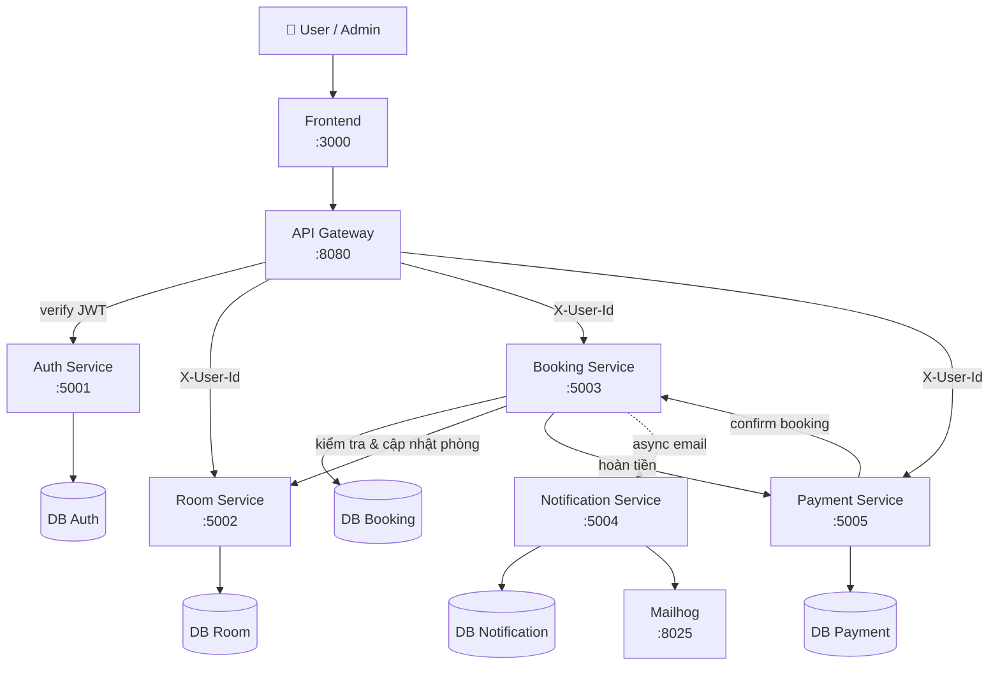

# 🏨 Hotel Booking System — Microservices Assignment

Hệ thống đặt phòng khách sạn trực tuyến xây dựng theo kiến trúc microservices. Khách hàng có thể tìm kiếm phòng, đặt phòng và hủy đặt phòng qua giao diện web. Quản trị viên có thể quản lý danh sách phòng và theo dõi trạng thái đặt phòng.

> **Technology-agnostic**: Mỗi service có thể dùng ngôn ngữ/framework khác nhau, tất cả chạy trong Docker containers.

---

## 👥 Team Members

| Name | Student ID | Role | Contribution |
|------|------------|------|-------------|
| Phạm Thành Đạt | B22DCVT132 | Backend | Auth Service + Room Service |
| Lê Bùi Anh Duy | B22DCVT101 | Backend | Booking Service + Notification Service |
| Mạc Triệu Sơn  | B22DCDT269 | Backend + Frontend | Payment Service + Gateway + Frontend |

---

## 📁 Project Structure

```
microservices-assignment-starter/
├── README.md                       # This file — project overview
├── .env.example                    # Environment variable template
├── docker-compose.yml              # Multi-container orchestration
├── Makefile                        # Common development commands
│
├── docs/                           # 📖 Documentation
│   ├── analysis-and-design.md      # System analysis & service design
│   ├── architecture.md             # Architecture overview & diagrams
│   ├── asset/                      # Images, diagrams, visual assets
│   └── api-specs/                  # OpenAPI 3.0 specifications
│       ├── service-a.yaml
│       └── service-b.yaml
│
├── frontend/                       # 🖥️ Frontend application
│   ├── Dockerfile
│   ├── readme.md
│   └── src/
│
├── gateway/                        # 🚪 API Gateway / reverse proxy
│   ├── Dockerfile
│   ├── readme.md
│   └── src/
│
├── services/                       # ⚙️ Backend microservices
│   ├── service-a/
│   │   ├── Dockerfile
│   │   ├── readme.md
│   │   └── src/
│   └── service-b/
│       ├── Dockerfile
│       ├── readme.md
│       └── src/
│
├── scripts/                        # 🔧 Utility scripts
│   └── init.sh
│
├── .ai/                            # 🤖 AI-assisted development
│   ├── AGENTS.md                   # Agent instructions (source of truth)
│   ├── vibe-coding-guide.md        # Hướng dẫn vibe coding
│   └── prompts/                    # Reusable prompt templates
│       ├── new-service.md
│       ├── api-endpoint.md
│       ├── create-dockerfile.md
│       ├── testing.md
│       └── debugging.md
│
├── .github/copilot-instructions.md # GitHub Copilot instructions
├── .cursorrules                    # Cursor AI instructions
├── .windsurfrules                  # Windsurf AI instructions
└── CLAUDE.md                       # Claude Code instructions
```

---

## 🚀 Getting Started

### Prerequisites

- [Docker Desktop](https://docs.docker.com/get-docker/) (includes Docker Compose)
- [Git](https://git-scm.com/)
- An AI coding tool (recommended): [GitHub Copilot](https://github.com/features/copilot), [Cursor](https://cursor.sh), [Windsurf](https://codeium.com/windsurf), or [Claude Code](https://docs.anthropic.com/en/docs/claude-code)

### Quick Start

```bash
# 1. Clone this repository
git clone https://github.com/jnp2018/mid-project-101132269.git
cd mid-project-101132269

# 2. Khởi tạo môi trường
cp .env.example .env

# 3. Build và chạy toàn bộ services
docker compose up --build

# 4. Kiểm tra các service
curl http://localhost:8080/health          # Gateway
curl http://localhost:5001/health          # Auth Service
curl http://localhost:5002/health          # Room Service
curl http://localhost:5003/health          # Booking Service
curl http://localhost:5004/health          # Payment Service
curl http://localhost:3000                 # Frontend
```

### Using Make (optional)

```bash
make help      # Show all available commands
make init      # Initialize project
make up        # Build and start all services
make down      # Stop all services
make logs      # View logs
make clean     # Remove everything
```

---

## 🏗️ Architecture



| Component | Mô tả | Port | Người phụ trách |
|-----------|-------|------|-----------------|
| **Frontend** | Giao diện web — tìm phòng, đặt phòng, thanh toán, admin | 3000 | Mạc Triệu Sơn |
| **Gateway** | API routing, xác thực JWT tập trung, rate limiting | 8080 | Mạc Triệu Sơn |
| **Auth Service** | Đăng ký, đăng nhập, xác thực JWT, quản lý user | 5001 | Phạm Thành Đạt |
| **Room Service** | Quản lý phòng, tìm phòng theo ngày | 5002 | Phạm Thành Đạt |
| **Booking Service** | Quản lý đặt phòng, hủy phòng, lịch sử | 5003 | Lê Bùi Anh Duy |
| **Notification Service** | Gửi email xác nhận đặt/hủy phòng | 5004 | Lê Bùi Anh Duy |
| **Payment Service** | Xử lý thanh toán, hoàn tiền, thống kê | 5005 | Mạc Triệu Sơn |
| **Mailhog** | Mock SMTP — xem email test tại localhost:8025 | 8025 | — |

> 📖 Tài liệu kiến trúc đầy đủ: [`docs/architecture.md`](docs/architecture.md)

---

## 🤖 AI-Assisted Development (Vibe Coding)

This repo is pre-configured for **AI-powered development**. Each AI tool auto-loads its instruction file:

| Tool | Config File |
|------|-------------|
| GitHub Copilot | `.github/copilot-instructions.md` |
| Cursor | `.cursorrules` |
| Claude Code | `CLAUDE.md` |
| Windsurf | `.windsurfrules` |

All instruction files point to [`.ai/AGENTS.md`](.ai/AGENTS.md) as the single source of truth.
Ready-to-use prompt templates are in [`.ai/prompts/`](.ai/prompts/).

> 📖 Full guide (Vietnamese): [`.ai/vibe-coding-guide.md`](.ai/vibe-coding-guide.md)

---

## 📋 Recommended Workflow

### Phase 1: Analysis & Design
- [x] Chọn domain: Hệ thống đặt phòng khách sạn
- [x] Phân công công việc cho 3 thành viên
- [x] Tài liệu phân tích tại [`docs/analysis-and-design.md`](docs/analysis-and-design.md)
- [x] Kiến trúc hệ thống tại [`docs/architecture.md`](docs/architecture.md)

### Phase 2: API Design
- [ ] Định nghĩa API OpenAPI 3.0 trong [`docs/api-specs/`](docs/api-specs/)
- [ ] Bao gồm tất cả endpoints, request/response schemas
- [ ] Review API design với nhóm

### Phase 3: Implementation
- [ ] Chọn tech stack cho mỗi service
- [ ] Cập nhật Dockerfiles
- [ ] Implement `GET /health` ở mọi service
- [ ] Implement business logic và API endpoints
- [ ] Cấu hình API Gateway routing
- [ ] Xây dựng frontend UI

### Phase 4: Testing & Documentation
- [ ] Viết unit test và integration test
- [ ] Verify `docker compose up --build` khởi động toàn bộ
- [ ] Cập nhật `readme.md` của từng service
- [ ] Hoàn thiện `README.md`

---

## 🧪 Development Guidelines

- **Health checks**: Every service MUST expose `GET /health` → `{"status": "ok"}`
- **Environment**: Use `.env` for configuration, never hardcode secrets
- **Networking**: Services communicate via Docker Compose DNS (use service names, not `localhost`)
- **API specs**: Keep OpenAPI specs in sync with implementation
- **Git workflow**: Use branches, write meaningful commit messages, commit often

---

## 👩‍🏫 Assignment Submission Checklist

- [x] `README.md` cập nhật thông tin nhóm, mô tả services, phân công
- [x] Kiến trúc tài liệu hóa trong `docs/architecture.md`
- [x] Phân tích thiết kế trong `docs/analysis-and-design.md`
- [ ] API specs đầy đủ trong `docs/api-specs/` (auth, room, booking, notification, payment)
- [ ] Tất cả services khởi động với `docker compose up --build`
- [ ] Mọi service có `GET /health` hoạt động
- [ ] Mỗi service có `readme.md` riêng
- [ ] Code sạch, tuân theo convention của ngôn ngữ
- [ ] Tests đầy đủ và pass

---

## Author

This template was created by **Hung Dang**.
- Email: hungdn@ptit.edu.vn
- GitHub: [hungdn1701](https://github.com/hungdn1701)

Good luck! 💪🚀

