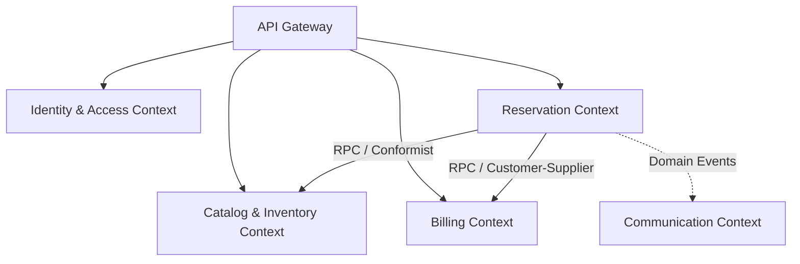
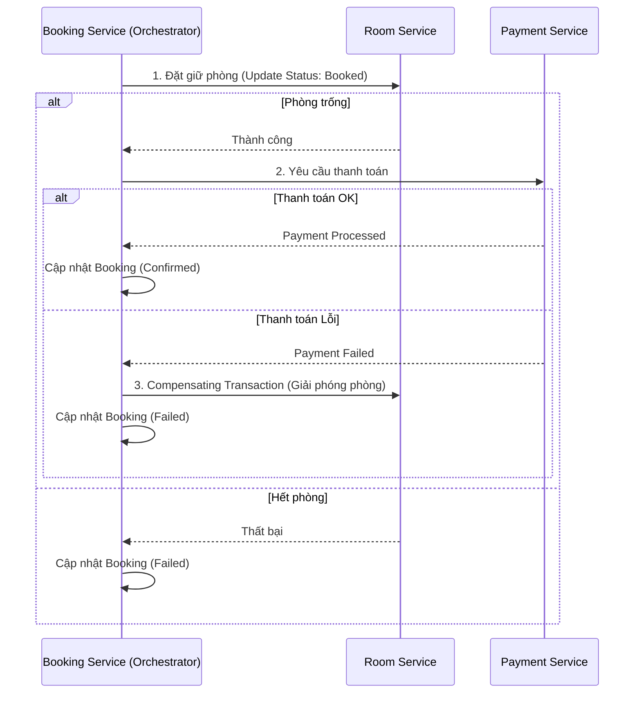
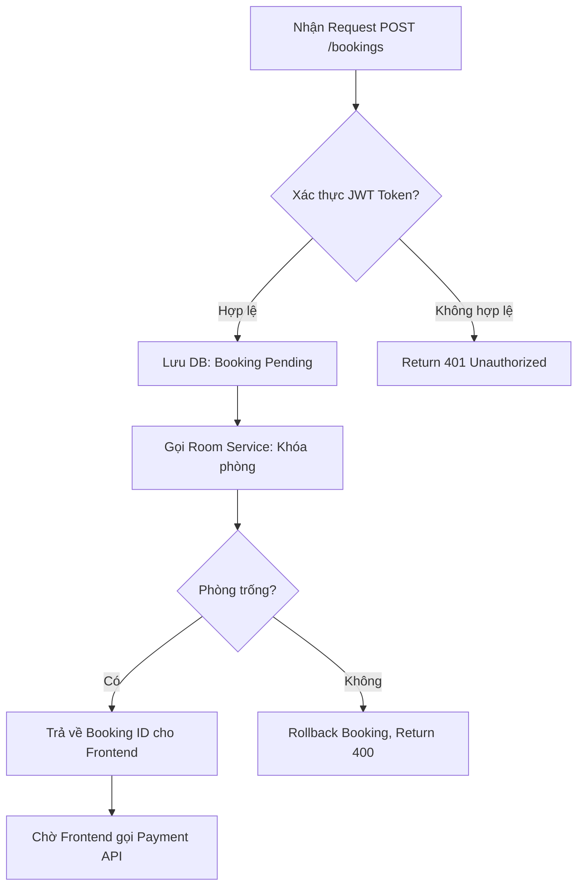

# 📊 Analysis and Design — Domain-Driven Design Approach

**Project:** Hệ thống đặt phòng khách sạn trực tuyến
**Team:** 
- **Lê Bùi Anh Duy** (B22DCVT101) — Phụ trách Domain Discovery, Event Storming & Commands
- **Phạm Thành Đạt** (B22DCVT132) — Phụ trách Aggregates, Bounded Contexts & Context Map
- **Mạc Triệu Sơn** (B22DCDT269) — Phụ trách Service Contracts, Service Logic (Saga Pattern)

**References:**
1. *Domain-Driven Design: Tackling Complexity in the Heart of Software* — Eric Evans
2. *Microservices Patterns: With Examples in Java* — Chris Richardson

> **Lưu ý:** Document này áp dụng chuẩn phương pháp Domain-Driven Design (DDD) từ cuốn sách *Microservices Patterns* của Chris Richardson, tập trung vào việc tìm ra ranh giới service (Bounded Contexts) thông qua Domain Events, Aggregates và giải quyết bài toán giao dịch phân tán bằng Saga Pattern.

---

## Part 1 — Domain Discovery
*(Phụ trách: Lê Bùi Anh Duy)*

### 1.1 Business Process Definition

- **Domain**: Hospitality / Quản lý và Đặt phòng khách sạn
- **Business Process**: Quy trình khách hàng tìm kiếm phòng trống, đặt phòng, thanh toán trực tuyến, và quản trị viên quản lý danh mục phòng.
- **Actors**: 
  - **Guest (Khách hàng)**: Tìm phòng, đặt phòng, thanh toán, xem lịch sử.
  - **Admin (Quản trị viên)**: Quản lý phòng, theo dõi trạng thái booking.
- **Scope**: Hệ thống quản lý tài khoản, phòng, quy trình đặt phòng, thanh toán và thông báo qua email.

### 1.2 Existing Automation Systems

| System Name | Type | Current Role | Interaction Method |
|-------------|------|--------------|-------------------|
| Mailhog     | Mock SMTP Server | Gửi email thông báo (cho môi trường dev) | SMTP/REST API |
| Cổng thanh toán (Mock) | Mock Payment Gateway | Xử lý thanh toán thẻ/ngân hàng | REST API |

> Với hệ thống thật, chưa có hệ thống tự động hóa nào (quy trình đăng ký khách sạn hiện tại là thủ công).

### 1.3 Non-Functional Requirements

| Requirement    | Description |
|----------------|-------------|
| Performance    | Thời gian phản hồi API < 500ms; Hỗ trợ truy xuất tìm kiếm phòng nhanh. |
| Security       | Xác thực JWT qua API Gateway, mã hóa mật khẩu bằng BCrypt. |
| Scalability    | Kiến trúc Microservices cho phép scale độc lập từng Bounded Context (ví dụ: scale Booking khi có lượng đặt phòng lớn). |
| Availability   | Đảm bảo tính sẵn sàng cao (99.9%); Không có single point of failure ngoại trừ Gateway. |

---

## Part 2 — Strategic Domain-Driven Design
*(Phụ trách: Lê Bùi Anh Duy & Phạm Thành Đạt)*

### 2.1 Event Storming — Domain Events
*(Phụ trách: Lê Bùi Anh Duy)*

Các sự kiện (Domain Events) diễn ra trong hệ thống, được viết ở thì quá khứ (Past Tense):

| # | Domain Event | Triggered By | Description |
|---|-------------|--------------|-------------|
| 1 | `UserRegistered` | Guest | Một khách hàng mới đăng ký tài khoản thành công. |
| 2 | `RoomCreated` | Admin | Quản trị viên thêm một phòng mới vào hệ thống. |
| 3 | `RoomStatusUpdated` | Admin / System | Trạng thái phòng thay đổi (VD: Available -> Booked). |
| 4 | `BookingCreated` | Guest | Khách hàng tạo yêu cầu đặt phòng (trạng thái Pending). |
| 5 | `PaymentProcessed` | Guest | Khách hàng thực hiện thanh toán thành công. |
| 6 | `PaymentFailed` | Guest | Giao dịch thanh toán bị từ chối hoặc lỗi. |
| 7 | `BookingConfirmed` | System | Hệ thống xác nhận booking sau khi thanh toán thành công. |
| 8 | `BookingCancelled` | Guest | Khách hàng hủy đặt phòng. |
| 9 | `NotificationSent` | System | Email xác nhận hoặc hủy được gửi cho khách hàng. |

### 2.2 Commands and Actors
*(Phụ trách: Lê Bùi Anh Duy)*

Các hành động (Commands) kích hoạt các Domain Events:

| Command | Actor | Triggers Event(s) |
|---------|-------|--------------------|
| `RegisterUser` | Guest | `UserRegistered` |
| `CreateRoom` | Admin | `RoomCreated` |
| `UpdateRoomStatus` | Admin / Booking Saga | `RoomStatusUpdated` |
| `CreateBooking` | Guest | `BookingCreated` |
| `ProcessPayment` | Guest | `PaymentProcessed` hoặc `PaymentFailed` |
| `ConfirmBooking` | Payment Saga | `BookingConfirmed`, `NotificationSent` |
| `CancelBooking` | Guest | `BookingCancelled`, `RoomStatusUpdated`, `NotificationSent` |

### 2.3 Aggregates
*(Phụ trách: Phạm Thành Đạt)*

Nhóm các Commands và Events xoay quanh các thực thể kinh doanh cốt lõi (Aggregates). Theo Chris Richardson, mỗi Aggregate là một Transaction Boundary.

| Aggregate | Commands | Domain Events | Owned Data |
|-----------|----------|---------------|------------|
| **User** | `RegisterUser` | `UserRegistered` | id, email, password_hash, role |
| **Room** | `CreateRoom`, `UpdateRoomStatus` | `RoomCreated`, `RoomStatusUpdated` | id, room_number, type, price, status |
| **Booking** | `CreateBooking`, `ConfirmBooking`, `CancelBooking` | `BookingCreated`, `BookingConfirmed`, `BookingCancelled` | id, user_id, room_id, dates, status, total_price |
| **Payment** | `ProcessPayment` | `PaymentProcessed`, `PaymentFailed` | id, booking_id, amount, status |

### 2.4 Bounded Contexts
*(Phụ trách: Phạm Thành Đạt)*

Mỗi Bounded Context được ánh xạ thành một Microservice độc lập, sở hữu Database riêng biệt (Database-per-service pattern).

| Bounded Context | Aggregates | Microservice | Responsibility |
|-----------------|------------|--------------|----------------|
| **Identity & Access** | User | Auth Service | Quản lý thông tin tài khoản và xác thực (JWT). |
| **Catalog & Inventory** | Room | Room Service | Quản lý danh mục phòng và tình trạng phòng. |
| **Reservation** | Booking | Booking Service | Điều phối quy trình đặt phòng, quản lý vòng đời Booking. |
| **Billing** | Payment | Payment Service | Xử lý giao dịch thanh toán và hoàn tiền. |
| **Communication** | Notification | Notification Service | Gửi email thông báo cho khách hàng. |

### 2.5 Context Map
*(Phụ trách: Phạm Thành Đạt)*

Thể hiện mối quan hệ giữa các Bounded Contexts theo ngôn ngữ DDD.

| Upstream | Downstream | Relationship Type | Description |
|----------|------------|-------------------|-------------|
| Catalog & Inventory | Reservation | Conformist (RPC) | Booking gọi Room qua REST để kiểm tra/cập nhật phòng. Booking phụ thuộc vào model của Room. |
| Billing | Reservation | Customer / Supplier | Payment Service xử lý thanh toán và thông báo lại cho Booking Service. |
| Reservation | Communication | Published Language / Async Event | Booking Service phát sinh sự kiện (qua REST Async/Queue), Notification lắng nghe để gửi mail. |

---

## Part 3 — Service-Oriented Design & Patterns
*(Phụ trách: Mạc Triệu Sơn)*

Dựa theo *Microservices Patterns*, hệ thống áp dụng các mẫu sau:

### 3.1 Design Patterns (Chris Richardson)
- **Database per Service**: Đảm bảo Loose Coupling. Mỗi Bounded Context sở hữu một Database PostgreSQL riêng, không truy cập chéo.
- **API Gateway**: Cung cấp entry point duy nhất, xử lý Cross-cutting concerns (Xác thực JWT).
- **Saga Pattern (Choreography / Orchestration)**: Xử lý Distributed Transaction (Giao dịch phân tán) khi Đặt phòng.

**Saga Pattern Flow cho Đặt phòng:**

### 3.2 Uniform Contract Design (APIs)
Các API RESTful tương ứng với các Bounded Contexts. Gateway định tuyến request:

**Identity & Access (Auth Service - Port 5001):**
| Endpoint | Method | Media Type | Response Codes |
|----------|--------|------------|----------------|
| `/auth/login` | POST | `application/json` | 200 (OK), 401 (Unauthorized) |
| `/auth/register` | POST | `application/json` | 201 (Created), 400 (Bad Request) |

**Catalog & Inventory (Room Service - Port 5002):**
| Endpoint | Method | Media Type | Response Codes |
|----------|--------|------------|----------------|
| `/rooms/available` | GET | `application/json` | 200 (OK) |
| `/rooms/{id}/status` | PATCH | `application/json` | 200 (OK), 404 (Not Found) |

**Reservation (Booking Service - Port 5003):**
| Endpoint | Method | Media Type | Response Codes |
|----------|--------|------------|----------------|
| `/bookings` | POST | `application/json` | 201 (Created), 400 (Bad Request) |
| `/bookings/{id}/confirm` | PATCH | `application/json` | 200 (OK) |

**Billing (Payment Service - Port 5005):**
| Endpoint | Method | Media Type | Response Codes |
|----------|--------|------------|----------------|
| `/payments` | POST | `application/json` | 201 (Created), 402 (Payment Required) |

### 3.3 Service Logic Design (Flowcharts)

**Quy trình xử lý Request tạo Booking (Booking Service):**

