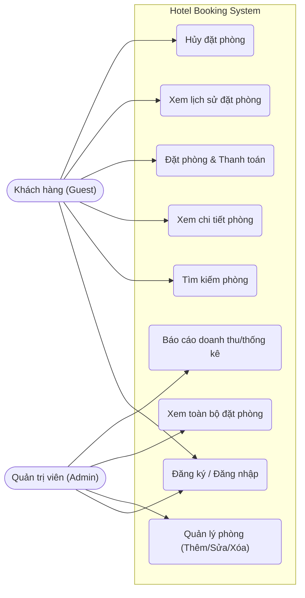
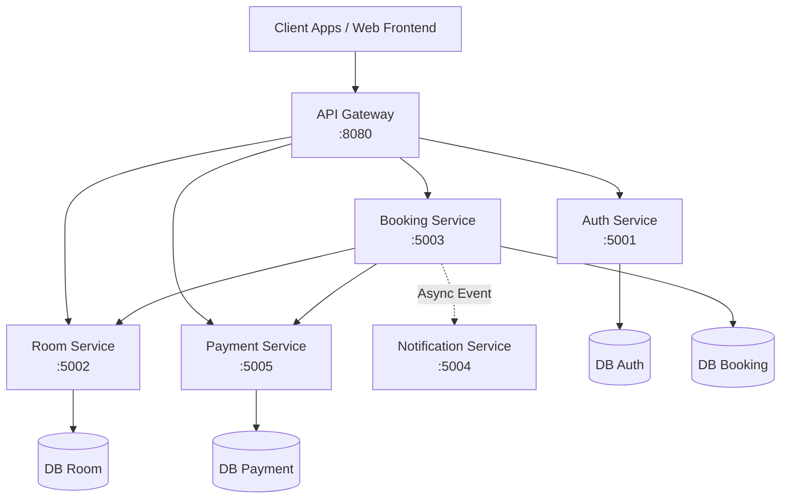
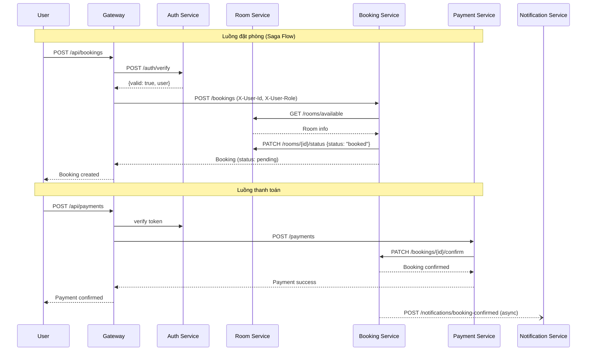
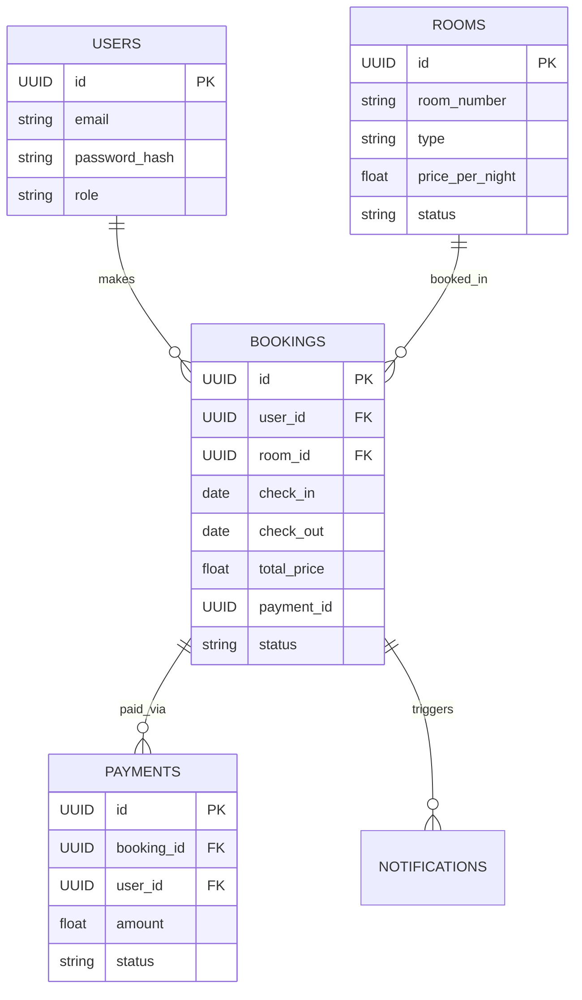
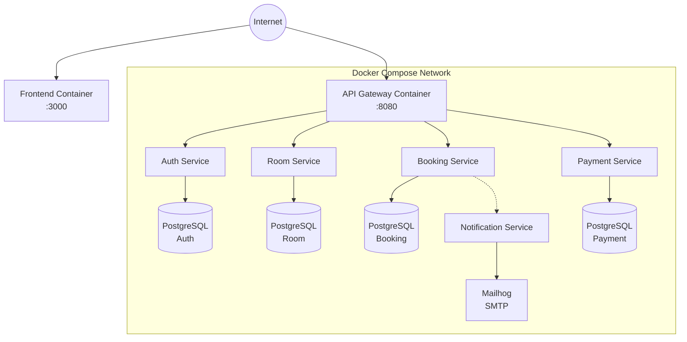

# 📊 Microservices System — Analysis and Design

**Project:** Hệ thống đặt phòng khách sạn trực tuyến
**Team:** 
- **Phạm Thành Đạt** (B22DCVT132) — Phụ trách Kiến trúc Hệ thống, Thiết kế CSDL & Sơ đồ Triển khai
- **Lê Bùi Anh Duy** (B22DCVT101) — Phụ trách Phân tích Yêu cầu, Use Case Diagram & Tech Stack
- **Mạc Triệu Sơn** (B22DCDT269) — Phụ trách Thiết kế API, Design Patterns & UML Diagrams

**References:**
1. *Service-Oriented Architecture: Analysis and Design for Services and Microservices* — Thomas Erl (2nd Edition)
2. *Microservices Patterns: With Examples in Java* — Chris Richardson
3. *Bài tập — Phát triển phần mềm hướng dịch vụ* — Hung DN (2024)

---

## 1. 🎯 Requirements Analysis & Problem Statement
*(Phụ trách: Lê Bùi Anh Duy)*

- **Domain**: Hospitality / Đặt phòng khách sạn
- **Problem**: Khách hàng gặp khó khăn khi tìm kiếm và đặt phòng khách sạn thủ công qua điện thoại hoặc đến trực tiếp. Quản lý khách sạn cũng thiếu công cụ để theo dõi tình trạng phòng và lịch đặt phòng theo thời gian thực. Ngoài ra, hệ thống cần bảo mật (xác thực người dùng) và hỗ trợ thanh toán trực tuyến để vận hành thực tế.
- **Users/Actors**:
  - **Khách hàng (Guest)**: Đăng ký, đăng nhập, tìm kiếm phòng, đặt phòng, thanh toán, hủy đặt phòng, xem lịch sử
  - **Quản trị viên (Admin)**: Quản lý phòng, xem và cập nhật trạng thái đặt phòng, xem báo cáo
- **Scope**:
  - **In scope**: Xác thực người dùng, quản lý phòng, đặt/hủy phòng, thanh toán, thông báo email, lịch sử giao dịch
  - **Out of scope**: Đánh giá khách sạn, quản lý nhân viên, tích hợp cổng thanh toán thực (dùng mock), đa ngôn ngữ

### 1.1 Use Case Diagram

---

## 2. 🧩 Service-Oriented Analysis
*(Phụ trách: Lê Bùi Anh Duy & Phạm Thành Đạt)*

### 2.1 Business Process Decomposition
| Step | Activity                | Actor      | Description                                                         |
|------|-------------------------|------------|---------------------------------------------------------------------|
| 1    | Đăng ký tài khoản       | Khách hàng | Tạo tài khoản mới với email, mật khẩu, thông tin cá nhân           |
| 2    | Đăng nhập               | Khách/Admin| Xác thực thông tin, nhận JWT token                                  |
| 3    | Xem danh sách phòng     | Khách hàng | Xem các phòng còn trống, lọc theo loại/ngày/giá                    |
| 4    | Xem chi tiết phòng      | Khách hàng | Xem mô tả, tiện nghi, giá, ảnh phòng                               |
| 5    | Tạo đặt phòng           | Khách hàng | Chọn phòng, nhập ngày check-in/check-out, tạo booking              |
| 6    | Nhận email xác nhận     | Hệ thống   | Gửi email xác nhận booking tới khách hàng                          |
| 7    | Thanh toán              | Khách hàng | Thanh toán booking, hệ thống xác nhận giao dịch                    |
| 8    | Xác nhận đặt phòng      | Hệ thống   | Sau thanh toán thành công, cập nhật trạng thái booking & phòng     |
| 9    | Xem lịch sử đặt phòng   | Khách hàng | Xem danh sách booking và trạng thái, lịch sử thanh toán            |
| 10   | Hủy đặt phòng           | Khách hàng | Hủy booking, hoàn tiền nếu đủ điều kiện, cập nhật phòng trống     |
| 11   | Nhận email hủy phòng    | Hệ thống   | Gửi email xác nhận hủy và hoàn tiền tới khách hàng                 |
| 12   | Quản lý phòng           | Admin      | Thêm, sửa, xóa phòng; cập nhật trạng thái phòng                   |
| 13   | Xem tất cả đặt phòng    | Admin      | Xem toàn bộ booking, lọc theo trạng thái/ngày/khách hàng          |

### 2.2 Entity Identification
| Entity       | Attributes                                                                          | Owned By              |
|--------------|-------------------------------------------------------------------------------------|-----------------------|
| User         | id, name, email, password_hash, role, phone, created_at                            | Auth Service          |
| Room         | id, room_number, type, price_per_night, description, status, capacity, images      | Room Service          |
| Booking      | id, user_id, room_id, check_in, check_out, status, total_price, payment_id, created_at | Booking Service   |
| Payment      | id, booking_id, user_id, amount, method, status, transaction_id, created_at        | Payment Service       |
| Notification | id, user_id, booking_id, type, email, status, sent_at                              | Notification Service  |

### 2.3 Service Candidate Identification
Hệ thống được phân tách theo **business capability** và **bounded context**:
- **Auth Service**: Xác thực và phân quyền người dùng. *Entity Service* — sở hữu dữ liệu User, phát JWT token.
- **Room Service**: Quản lý toàn bộ thông tin phòng. *Entity Service* — sở hữu dữ liệu Room.
- **Booking Service**: Điều phối quy trình đặt phòng. *Task Service* — gọi Room Service (kiểm tra & cập nhật phòng), Notification Service (gửi email).
- **Payment Service**: Xử lý thanh toán. *Task Service* — gọi Booking Service (xác nhận booking sau thanh toán).
- **Notification Service**: Gửi email thông báo. *Utility Service* — nhận yêu cầu từ Booking Service, gửi email qua Mailhog.

---

## 3. 🔄 System Architecture & Service-Oriented Design
*(Phụ trách: Phạm Thành Đạt & Mạc Triệu Sơn)*

### 3.1 Microservices Decomposition
*(Phụ trách: Phạm Thành Đạt)*

### 3.2 Service Inventory
| Service               | Responsibility                                              | Type    | Port  | Người phụ trách   |
|-----------------------|-------------------------------------------------------------|---------|-------|-------------------|
| Auth Service          | Đăng ký, đăng nhập, xác thực JWT, quản lý user             | Entity  | 5001  | Phạm Thành Đạt    |
| Room Service          | Quản lý thông tin phòng khách sạn (CRUD)                    | Entity  | 5002  | Phạm Thành Đạt    |
| Booking Service       | Quản lý đặt phòng, hủy phòng, lịch sử booking              | Task    | 5003  | Lê Bùi Anh Duy    |
| Notification Service  | Gửi email xác nhận đặt phòng / hủy phòng                   | Utility | 5004  | Lê Bùi Anh Duy    |
| Payment Service       | Xử lý thanh toán, hoàn tiền, lịch sử giao dịch             | Task    | 5005  | Mạc Triệu Sơn     |
| Gateway               | API routing, xác thực JWT, rate limiting                    | Utility | 8080  | Mạc Triệu Sơn     |
| Frontend              | Giao diện người dùng cho khách và admin                     | UI      | 3000  | Mạc Triệu Sơn     |

### 3.3 Design Patterns
*(Phụ trách: Mạc Triệu Sơn)*
- **Database per Service**: Mỗi service có một CSDL PostgreSQL riêng biệt, không truy cập chéo.
- **API Gateway**: Tập trung định tuyến và xác thực (Gateway verify JWT, forward `X-User-Id`).
- **Saga Pattern**: Áp dụng cho Booking Flow. Booking Service đóng vai trò điều phối gọi Room Service và Payment Service.

### 3.4 Service Interactions (Sequence Diagram)
*(Phụ trách: Mạc Triệu Sơn)*

### 3.5 Data Ownership & Boundaries
| Data Entity  | Owner Service        | Access Pattern                                                              |
|--------------|----------------------|-----------------------------------------------------------------------------|
| User         | Auth Service         | CRUD qua REST API; Gateway verify token trước mỗi request                  |
| Room         | Room Service         | CRUD đầy đủ; Booking Service gọi để kiểm tra & cập nhật trạng thái         |
| Booking      | Booking Service      | CRUD qua REST API; lưu `payment_id` để gọi refund; Payment gọi để confirm  |
| Payment      | Payment Service      | CRUD qua REST API; độc lập, liên kết với Booking qua `booking_id`          |
| Notification | Notification Service | Write-only từ Booking Service; Admin đọc lịch sử qua REST API              |

---

## 4. 📋 API Specifications
*(Phụ trách: Mạc Triệu Sơn)*

Định nghĩa API đầy đủ tại:
- [`docs/api-specs/auth-service.yaml`](api-specs/auth-service.yaml) — Auth Service
- [`docs/api-specs/room-service.yaml`](api-specs/room-service.yaml) — Room Service
- [`docs/api-specs/booking-service.yaml`](api-specs/booking-service.yaml) — Booking Service
- [`docs/api-specs/notification-service.yaml`](api-specs/notification-service.yaml) — Notification Service
- [`docs/api-specs/payment-service.yaml`](api-specs/payment-service.yaml) — Payment Service

---

## 5. 🗄️ Database Design & Data Model
*(Phụ trách: Phạm Thành Đạt)*

### 5.1 Entity Relationship Diagram (ERD)

---

## 6. ❗ Non-Functional Requirements & Deployment
*(Phụ trách: Phạm Thành Đạt & Lê Bùi Anh Duy)*

| Requirement    | Description                                                                |
|----------------|----------------------------------------------------------------------------|
| Security       | JWT xác thực tại Gateway; forward `X-User-Id`, `X-User-Role` cho services |
| Performance    | Thời gian phản hồi < 500ms cho các thao tác thông thường                  |
| Scalability    | Mỗi service có thể scale độc lập bằng Docker                              |
| Availability   | Health check endpoint `GET /health` trên mọi service                      |
| Portability    | Chạy hoàn toàn trong Docker containers, không phụ thuộc host              |
| Data Isolation | Mỗi service có database PostgreSQL riêng, không truy cập chéo database    |
| Observability  | Gateway log toàn bộ request/response; mỗi service log lỗi nội bộ         |

### 6.1 Deployment Architecture

