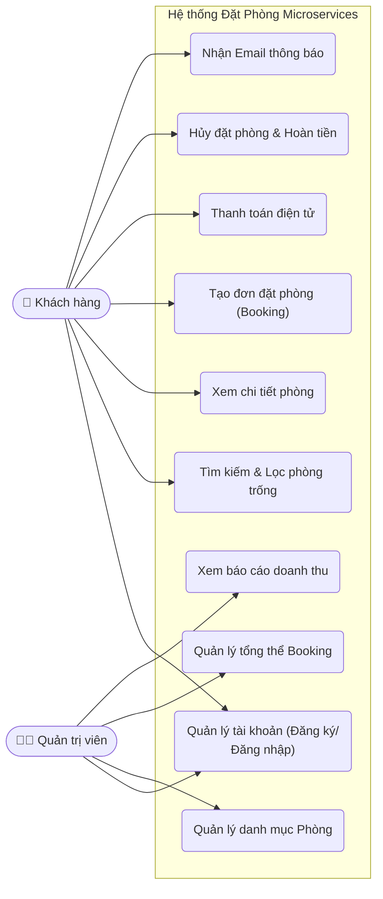
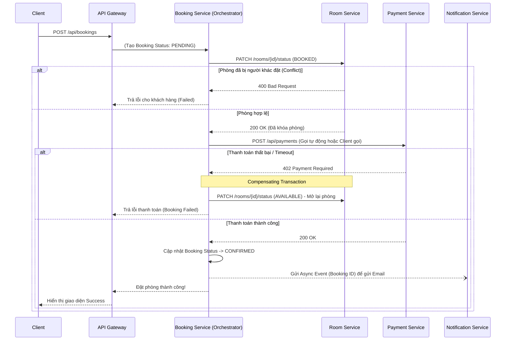
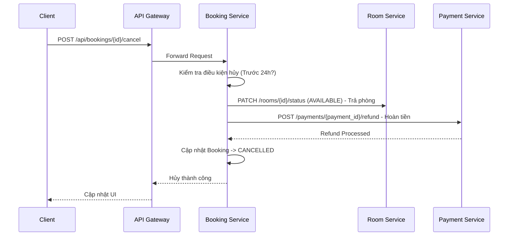
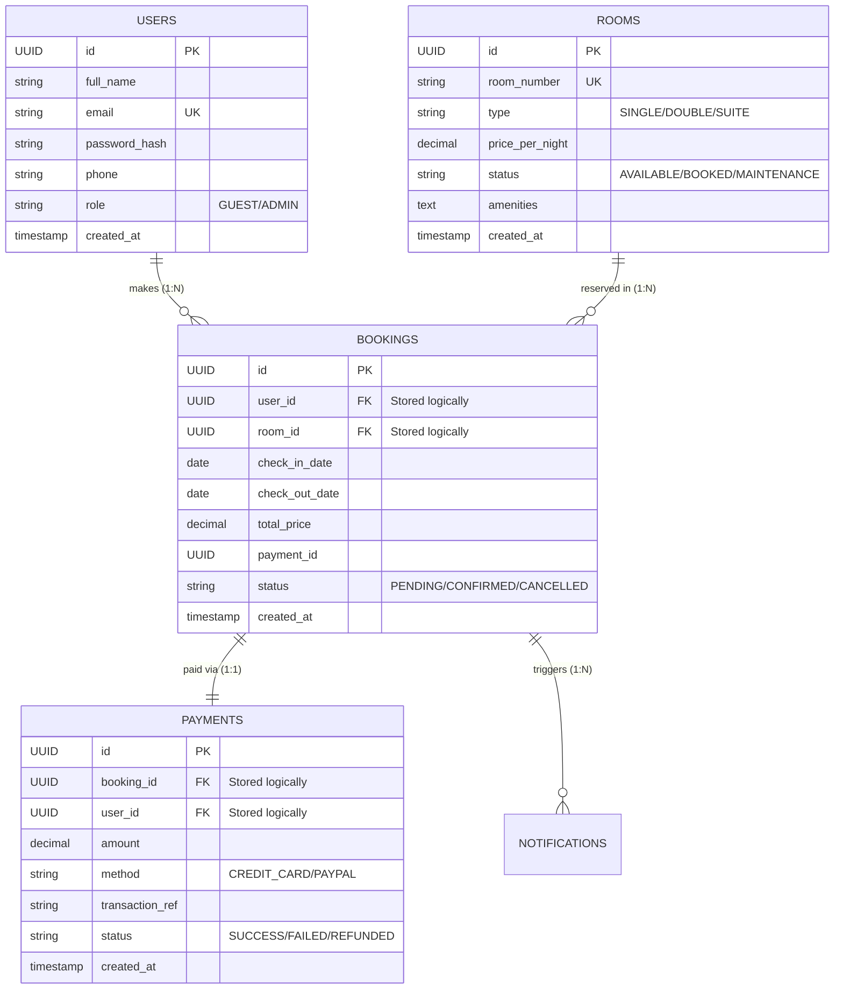

# 📊 Microservices System — In-Depth Analysis and Design

**Project:** Hệ thống đặt phòng khách sạn trực tuyến
**Team:** 
- **Phạm Thành Đạt** (B22DCVT132) — Phụ trách Kiến trúc Hệ thống, Thiết kế CSDL & Sơ đồ Triển khai
- **Lê Bùi Anh Duy** (B22DCVT101) — Phụ trách Phân tích Yêu cầu, Use Case Diagram & Tech Stack
- **Mạc Triệu Sơn** (B22DCDT269) — Phụ trách Thiết kế API, Design Patterns & UML Diagrams

**References:**
1. *Service-Oriented Architecture: Analysis and Design for Services and Microservices* — Thomas Erl (2nd Edition)
2. *Microservices Patterns: With Examples in Java* — Chris Richardson

---

## 1. 🎯 Requirements Analysis & Problem Statement
*(Phụ trách: Lê Bùi Anh Duy)*

### 1.1 Vấn đề nghiệp vụ (Problem Statement)
Quy trình đặt phòng khách sạn truyền thống gặp nhiều hạn chế: Khách hàng mất thời gian gọi điện kiểm tra phòng trống; Khách sạn khó khăn trong việc tránh "overbooking" (đặt trùng phòng); Không có hệ thống tự động xử lý thanh toán và hoàn tiền khi hủy phòng.

**Giải pháp:** Xây dựng hệ thống phân tán (Microservices) tự động hóa toàn bộ quy trình: Quản lý danh mục phòng, tìm kiếm theo thời gian thực, đặt phòng an toàn với Saga Pattern và thanh toán trực tuyến.

### 1.2 Yêu cầu chức năng chi tiết (Detailed Functional Requirements)

**A. Khách hàng (Guest):**
- **Quản lý tài khoản:** Đăng ký, đăng nhập, cập nhật hồ sơ, đổi mật khẩu.
- **Tìm kiếm & Trải nghiệm:**
  - Tìm phòng theo ngày Check-in / Check-out, số người.
  - Lọc phòng theo mức giá, loại phòng (Single/Double/Suite).
  - Xem chi tiết phòng (Mô tả, hình ảnh, tiện nghi).
- **Giao dịch (Đặt phòng & Thanh toán):**
  - Thực hiện đặt phòng, hệ thống tự động khóa (lock) phòng tạm thời.
  - Thanh toán trực tuyến (Mô phỏng cổng thanh toán).
  - Nhận email xác nhận (Invoice).
  - Hủy đặt phòng và nhận hoàn tiền (Refund) nếu đúng chính sách.
  - Xem lịch sử đặt phòng và trạng thái thanh toán.

**B. Quản trị viên (Admin):**
- **Quản lý tài nguyên khách sạn:** Thêm, sửa, xóa thông tin phòng, hình ảnh, cập nhật giá linh hoạt.
- **Quản lý đặt phòng:** Xem toàn bộ giao dịch, trạng thái đặt phòng (Pending, Confirmed, Cancelled). Thay đổi trạng thái thủ công khi có sự cố.
- **Thống kê:** Xem báo cáo doanh thu theo tháng, tỷ lệ lấp đầy phòng.

### 1.3 Yêu cầu phi chức năng (Non-Functional Requirements)
- **Security:** Mã hóa mật khẩu bằng BCrypt. Mọi request (trừ public API) đều phải mang chuỗi JWT hợp lệ. API Gateway chịu trách nhiệm xác thực tập trung.
- **Resilience (Khả năng chịu lỗi):** Sự cố ở Notification Service (VD: server mail chết) không được làm gián đoạn luồng đặt phòng.
- **Performance:** API tìm kiếm phòng trống phải phản hồi dưới 300ms.
- **Scalability:** Hệ thống có thể nhân bản (scale) riêng biệt Booking Service và Room Service khi mùa cao điểm du lịch tới.

### 1.4 Use Case Diagram


---

## 2. 🧩 Service-Oriented Analysis (Theo Thomas Erl)
*(Phụ trách: Lê Bùi Anh Duy & Phạm Thành Đạt)*

Để xác định ranh giới các dịch vụ, chúng ta áp dụng phân rã quy trình nghiệp vụ (Business Process Decomposition) từ góc nhìn Service-Oriented Architecture (SOA).

### 2.1 Phân rã quy trình nghiệp vụ (Business Process Decomposition)

Hệ thống được chia thành 4 quy trình nghiệp vụ cốt lõi:

**Quy trình 1: Quản lý danh tính (Identity Process)**
1. User nhập thông tin đăng ký -> Hệ thống băm mật khẩu, lưu DB.
2. User đăng nhập -> Hệ thống cấp phát JWT token có thời hạn.

**Quy trình 2: Quản lý danh mục và tìm kiếm (Catalog & Search Process)**
1. Admin tạo cấu hình phòng (giá, số lượng, hình ảnh).
2. Guest nhập tiêu chí tìm kiếm -> Hệ thống quét dữ liệu và loại trừ các phòng đã được đặt trong khoảng thời gian đó.

**Quy trình 3: Vòng đời đặt phòng (Reservation Lifecycle Process)**
1. Guest chọn phòng, chọn ngày -> Hệ thống tạo Booking ở trạng thái `PENDING`.
2. Hệ thống kiểm tra và khóa (reserve) quỹ phòng tạm thời.
3. Guest thanh toán -> Hệ thống cập nhật Booking sang `CONFIRMED`.
4. Gửi Email Invoice cho Guest.

**Quy trình 4: Quy trình Hủy & Hoàn tiền (Cancellation & Refund Process)**
1. Guest yêu cầu hủy -> Hệ thống kiểm tra chính sách thời gian.
2. Hệ thống cập nhật Booking sang `CANCELLED`.
3. Hệ thống mở khóa (release) quỹ phòng.
4. Yêu cầu Payment Gateway hoàn tiền lại thẻ của Guest.
5. Gửi Email xác nhận hủy.

### 2.2 Nhận diện thực thể (Entity Identification & Modeling)

Dựa trên các quy trình trên, chúng ta rút trích ra các Thực thể (Entities) cốt lõi:

| Thực thể (Entity) | Thuộc tính chính (Key Attributes) | Liên kết (Relationships) | Phân loại SOA |
|-------------------|-----------------------------------|--------------------------|---------------|
| **User** | id, email, password_hash, role, profile | 1 User -> N Bookings | Entity Model |
| **Room** | id, room_number, type, base_price, amenities, status | 1 Room -> N Bookings | Entity Model |
| **Booking** | id, check_in, check_out, total_amount, status | Thuộc về 1 User, 1 Room | Task / Process Model |
| **Payment** | id, amount, method, status, transaction_ref | Gắn với 1 Booking | Task Model |
| **Notification** | id, email_to, template, status, sent_at | Kích hoạt bởi Booking | Utility Model |

### 2.3 Phân định Dịch vụ (Service Candidate Identification)

Dựa trên nguyên tắc *Service Autonomy* (Tự trị) và *Service Reusability* (Tái sử dụng) của SOA:

1. **Auth Service (Entity Service)**: Đóng gói toàn bộ logic về User và BCrypt/JWT. Tái sử dụng cho mọi yêu cầu xác thực.
2. **Room Service (Entity Service)**: Đóng gói dữ liệu phòng. Chịu trách nhiệm bảo vệ tính nhất quán của trạng thái phòng.
3. **Booking Service (Task Service)**: Đóng vai trò là "Orchestrator" (người điều phối) ghép nối Room Service, Payment Service và Notification Service lại để hoàn thành 1 nghiệp vụ kinh doanh.
4. **Payment Service (Task Service)**: Chuyên biệt hóa việc tương tác với cổng thanh toán ngoài.
5. **Notification Service (Utility Service)**: Dịch vụ tiện ích dùng chung, chỉ nhận tín hiệu và đẩy email (SMTP).

---

## 3. 🔄 System Architecture & Microservices Patterns (Theo Chris Richardson)
*(Phụ trách: Phạm Thành Đạt & Mạc Triệu Sơn)*

### 3.1 Microservices Decomposition & API Gateway Pattern

```mermaid
graph TD
    Client[Client (Web/Mobile App)] -->|REST over HTTPS| API_GW[API Gateway<br>:8080]
    
    subgraph Private Docker Network
        API_GW -->|Route /api/auth| US[Auth Service<br>:5001]
        API_GW -->|Route /api/rooms| RS[Room Service<br>:5002]
        API_GW -->|Route /api/bookings| BS[Booking Service<br>:5003]
        API_GW -->|Route /api/payments| PS[Payment Service<br>:5005]
        
        BS -->|REST RPC| RS
        BS -->|REST RPC| PS
        BS -.->|Async Message| NS[Notification Service<br>:5004]
        
        US --> DBU[(PostgreSQL<br>Auth)]
        RS --> DBR[(PostgreSQL<br>Room)]
        BS --> DBB[(PostgreSQL<br>Booking)]
        PS --> DBP[(PostgreSQL<br>Payment)]
        NS --> MH[Mailhog SMTP<br>:8025]
    end
```

### 3.2 Các Mẫu thiết kế (Design Patterns) áp dụng

1. **API Gateway Pattern**: 
   - Đóng vai trò mặt tiền (Facade) cho hệ thống.
   - **Authentication Translation**: Gateway là nơi duy nhất phân tích JWT Token. Nếu hợp lệ, nó sẽ chèn thêm header `X-User-Id` và `X-User-Role` rồi đẩy (forward) request xuống các Service bên dưới. Các Service bên dưới hoàn toàn tin tưởng header này.
2. **Database-per-Service Pattern**:
   - Đảm bảo tính lỏng lẻo (Loose Coupling). Nếu DB của Room Service chết, Auth Service vẫn hoạt động bình thường. Ngăn chặn việc join (kết nối) bảng trực tiếp giữa các service.
3. **Saga Pattern (Orchestration Approach)**:
   - Thay vì dùng ACID Transaction (2PC) rất chậm trong hệ thống phân tán, hệ thống dùng Saga. Booking Service điều phối toàn bộ các bước Đặt phòng -> Khóa phòng -> Thanh toán. Nếu bất kỳ bước nào lỗi, nó sẽ phát lệnh gọi các giao dịch bồi hoàn (Compensating Transactions) để đảo ngược trạng thái.
4. **Circuit Breaker Pattern (Dự kiến)**:
   - Nếu Payment Service phải gọi API của ngân hàng thật và ngân hàng bị chậm (timeout), Circuit Breaker sẽ "ngắt mạch" trả về lỗi ngay lập tức để không làm sập (exhaust) tài nguyên của hệ thống nội bộ.
5. **Async Messaging Pattern**:
   - Giao tiếp giữa Booking và Notification là bất đồng bộ (Asynchronous). Booking không cần chờ Email gửi xong mới trả kết quả cho khách hàng.

---

## 4. 📋 Detailed API Specifications (Uniform Contract)
*(Phụ trách: Mạc Triệu Sơn)*

Thiết kế giao tiếp giữa Client và Gateway tuân thủ chuẩn RESTful API.

### 4.1 Auth Service (`/api/auth`)
| Method | Endpoint | Authorization | Body Payload | Description |
|---|---|---|---|---|
| POST | `/login` | Public | `{email, password}` | Trả về chuỗi JWT Token. |
| POST | `/register`| Public | `{email, password, name, phone}` | Đăng ký tài khoản Guest mới. |
| GET | `/verify` | JWT (Gateway gọi) | N/A | Xác minh Token hợp lệ hay không. |

### 4.2 Room Service (`/api/rooms`)
| Method | Endpoint | Authorization | Body Payload | Description |
|---|---|---|---|---|
| GET | `/` | Public | `?type=single&min_price=100` | Liệt kê toàn bộ phòng (có lọc). |
| GET | `/available` | Public | `?check_in=...&check_out=...` | Tìm các phòng còn trống trong khung giờ. |
| POST | `/` | Admin | `{room_number, type, price...}` | Tạo phòng mới. |
| PATCH | `/{id}/status` | Internal (Booking gọi) | `{status: "booked"}` | Đánh dấu phòng đã được giữ. |

### 4.3 Booking Service (`/api/bookings`)
| Method | Endpoint | Authorization | Body Payload | Description |
|---|---|---|---|---|
| POST | `/` | Guest | `{room_id, check_in, check_out}` | Khởi tạo đơn đặt phòng (PENDING). |
| GET | `/{id}` | Guest / Admin | N/A | Lấy chi tiết đơn đặt phòng. |
| PATCH | `/{id}/confirm`| Internal (Payment gọi)| N/A | Xác nhận đặt phòng sau khi trả tiền. |
| POST | `/{id}/cancel` | Guest | N/A | Yêu cầu hủy đặt phòng và hoàn tiền. |

### 4.4 Payment Service (`/api/payments`)
| Method | Endpoint | Authorization | Body Payload | Description |
|---|---|---|---|---|
| POST | `/` | Guest | `{booking_id, amount, method}` | Thanh toán đơn hàng. |
| POST | `/{id}/refund` | Internal (Booking gọi) | N/A | Yêu cầu hoàn lại tiền vào tài khoản. |

---

## 5. ⚙️ System Interactions & Workflows
*(Phụ trách: Mạc Triệu Sơn)*

### 5.1 Workflow 1: Đặt phòng và Thanh toán (Saga Orchestration)

Khi khách hàng bấm "Book & Pay", đây là một giao dịch phân tán đòi hỏi tính nhất quán.



### 5.2 Workflow 2: Quy trình Hủy phòng (Cancellation Flow)



---

## 6. 🗄️ Database Design & Entity Relationship Diagram (ERD)
*(Phụ trách: Phạm Thành Đạt)*

Mặc dù các CSDL bị phân tách vật lý (Database-per-service), về mặt logic, mô hình dữ liệu tổng thể trông như sau:



---

## 7. 🚀 Deployment Architecture & Operations
*(Phụ trách: Phạm Thành Đạt & Lê Bùi Anh Duy)*

### 7.1 Môi trường triển khai (Deployment)
- Toàn bộ kiến trúc được chạy trên **Docker Containers** và quản lý bằng **Docker Compose**.
- Các Services chia sẻ chung một mạng nội bộ ảo `hotel-network`.
- Databases PostgreSQL không được phơi bày (expose) port ra ngoài Internet, chỉ các service backend mới có quyền gọi vào.
- API Gateway (Kong/Express Gateway) là cửa ngõ duy nhất mở port `8080` ra ngoài để nhận traffic từ Client.

### 7.2 Observability & Fault Tolerance
- **Health Checks**: Mỗi service (Auth, Room, Booking, Payment) đều phải cài đặt endpoint `GET /health` để Load Balancer hoặc Docker engine theo dõi tình trạng sống còn của container.
- **Auto-Restart**: Các container được cấu hình `restart: unless-stopped` trong docker-compose.yml. Nếu code bị crash, Docker sẽ tự động dựng lại.
- **Log Aggregation (Dự kiến)**: Các service in log ra `stdout/stderr` theo chuẩn JSON để dễ dàng tích hợp ELK stack (Elasticsearch, Logstash, Kibana) trong tương lai.
