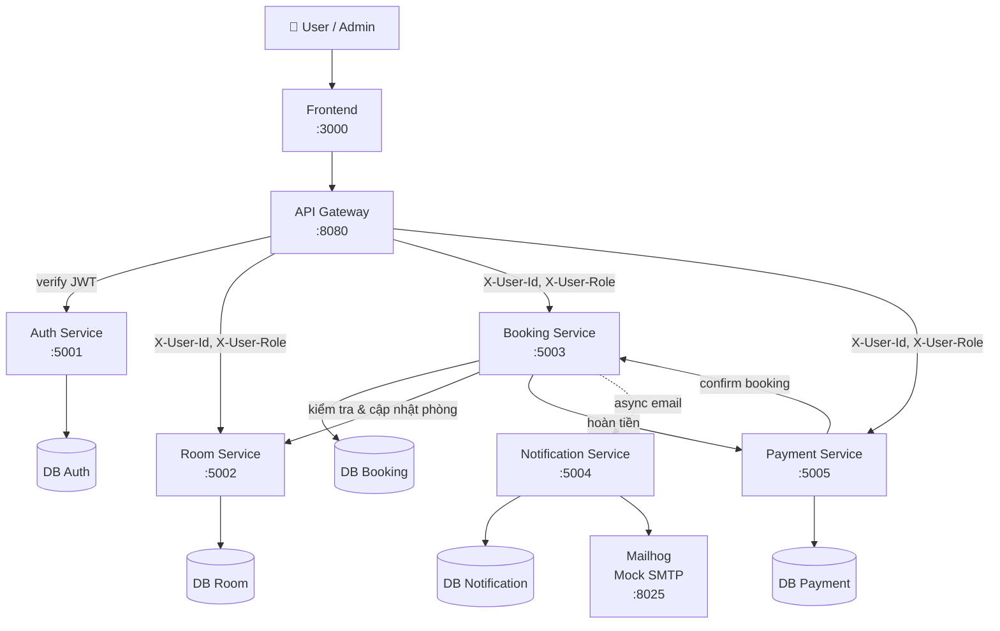

# 🏗️ System Architecture — Hotel Booking System

## 1. Overview

Hệ thống đặt phòng khách sạn trực tuyến cho phép khách hàng đăng ký, đăng nhập, tìm kiếm phòng, đặt phòng và thanh toán. Quản trị viên có thể quản lý phòng và theo dõi toàn bộ đặt phòng.

- **Problem**: Tự động hóa quy trình đặt phòng, tích hợp xác thực và thanh toán, thay thế quy trình thủ công
- **Target users**: Khách hàng đặt phòng, Admin quản lý khách sạn
- **Key quality attributes**: Bảo mật (JWT), module hóa, mỗi service scale độc lập, dễ triển khai bằng Docker

---

## 2. Architecture Style

- [x] Microservices
- [x] API Gateway pattern — xác thực JWT tập trung tại Gateway, forward `X-User-Id` và `X-User-Role` cho các service
- [ ] Event-driven / Message queue
- [ ] CQRS / Event Sourcing
- [x] Database per service
- [ ] Saga pattern

---

## 3. System Components

| Component                | Responsibility                                                    | Port  | Người phụ trách  |
|--------------------------|-------------------------------------------------------------------|-------|------------------|
| **Frontend**             | Giao diện web — đặt phòng, thanh toán, quản lý admin             | 3000  | Mạc Triệu Sơn    |
| **Gateway**              | API routing, xác thực JWT tập trung, rate limiting, request log   | 8080  | Mạc Triệu Sơn    |
| **Auth Service**         | Đăng ký, đăng nhập, xác thực JWT, quản lý user                   | 5001  | Phạm Thành Đạt   |
| **Room Service**         | Quản lý thông tin phòng khách sạn (CRUD), tìm phòng theo ngày    | 5002  | Phạm Thành Đạt   |
| **Booking Service**      | Quản lý đặt phòng, hủy phòng, lịch sử booking                    | 5003  | Lê Bùi Anh Duy   |
| **Notification Service** | Gửi email xác nhận đặt phòng / hủy phòng qua Mailhog             | 5004  | Lê Bùi Anh Duy   |
| **Payment Service**      | Xử lý thanh toán, hoàn tiền, thống kê doanh thu                  | 5005  | Mạc Triệu Sơn    |
| **Database Auth**        | Lưu dữ liệu User (PostgreSQL)                                     | —     | —                |
| **Database Room**        | Lưu dữ liệu Room (PostgreSQL)                                     | —     | —                |
| **Database Booking**     | Lưu dữ liệu Booking (PostgreSQL)                                  | —     | —                |
| **Database Payment**     | Lưu dữ liệu Payment (PostgreSQL)                                  | —     | —                |
| **Database Notification**| Lưu lịch sử Notification (PostgreSQL)                             | —     | —                |
| **Mailhog**              | Mock SMTP server để test email (không cần email thật)             | 8025  | —                |

> Các database chỉ giao tiếp nội bộ trong Docker network, không expose port ra host.

---

## 4. Communication Patterns

- **Synchronous REST**: Tất cả giao tiếp chính giữa các service
- **Asynchronous (fire-and-forget)**: Booking Service gửi notification — không chờ response
- **Authentication**: Gateway xác thực JWT với Auth Service **một lần duy nhất**, sau đó forward `X-User-Id` và `X-User-Role` trong header — các service downstream không cần tự xác thực lại
- **Service Discovery**: Docker Compose DNS (dùng tên service: `auth-service`, `room-service`, v.v.)

### Inter-service Communication Matrix

| From → To              | Auth          | Room  | Booking | Notification | Payment | Gateway       | DB  |
|------------------------|---------------|-------|---------|--------------|---------|---------------|-----|
| **Frontend**           |               |       |         |              |         | REST          |     |
| **Gateway**            | REST (verify) | REST  | REST    |              | REST    |               |     |
| **Auth Service**       |               |       |         |              |         |               | SQL |
| **Room Service**       |               |       |         |              |         |               | SQL |
| **Booking Service**    |               | REST  |         | REST (async) | REST    |               | SQL |
| **Notification Service**|              |       |         |              |         |               | SQL |
| **Payment Service**    |               |       | REST    |              |         |               | SQL |

---

## 5. Gateway Routing Table

| External Path     | Forward tới              | Internal URL                        |
|-------------------|--------------------------|-------------------------------------|
| `/api/auth/*`     | auth-service             | `http://auth-service:5001/*`        |
| `/api/rooms/*`    | room-service             | `http://room-service:5002/*`        |
| `/api/bookings/*` | booking-service          | `http://booking-service:5003/*`     |
| `/api/payments/*` | payment-service          | `http://payment-service:5005/*`     |
| `/health`         | gateway (self)           | —                                   |

> Notification Service không có route qua Gateway — chỉ nhận request nội bộ từ Booking Service.

---

## 6. Data Flow

### Luồng đăng nhập
```
User → Frontend → Gateway → Auth Service → DB Auth
                          ← JWT token
       Frontend ← Gateway ← JWT token
```

### Luồng đặt phòng (đã đăng nhập)
```
User → Frontend → Gateway → Auth Service (verify JWT)
                           → Booking Service (X-User-Id, X-User-Role)
                               → Room Service (GET /rooms/available?check_in&check_out)
                               → Room Service (PATCH /rooms/{id}/status: booked)
                               → DB Booking (tạo booking, status: pending)
                               → Notification Service (async: gửi email xác nhận)
       Frontend ← Gateway ← Booking (status: pending)
```

### Luồng thanh toán
```
User → Frontend → Gateway → Auth Service (verify JWT)
                           → Payment Service (X-User-Id)
                               → Booking Service (PATCH /bookings/{id}/confirm)
                               → DB Payment (lưu giao dịch, status: success)
       Frontend ← Gateway ← Payment success
```

### Luồng hủy đặt phòng
```
User → Frontend → Gateway → Auth Service (verify JWT)
                           → Booking Service (X-User-Id)
                               → Room Service (PATCH /rooms/{id}/status: available)
                               → Payment Service (POST /payments/{payment_id}/refund)
                               → DB Booking (status: cancelled)
                               → Notification Service (async: gửi email hủy)
       Frontend ← Gateway ← Booking cancelled + refund
```

---

## 7. Architecture Diagram



---

## 8. Deployment

- Toàn bộ services containerized với Docker
- Orchestration bằng Docker Compose
- Khởi động bằng một lệnh duy nhất: `docker compose up --build`
- Mỗi service có Dockerfile riêng
- Mỗi service có database PostgreSQL riêng (database per service pattern)
- Mailhog chạy như một container riêng, giao diện xem email tại `http://localhost:8025`
- Biến môi trường cấu hình qua file `.env`

---

## 9. Scalability & Fault Tolerance

- **Scale độc lập**: Mỗi service là container riêng biệt, có thể tăng replica độc lập
- **Fault isolation**: Một service gặp lỗi không làm sập toàn hệ thống
- **Async notification**: Notification Service lỗi không ảnh hưởng luồng đặt phòng chính
- **Health checks**: Mỗi service expose `GET /health → {"status": "ok"}`
- **Restart policy**: Docker Compose cấu hình `restart: unless-stopped`
- **Data isolation**: Mỗi service có database riêng, không truy cập chéo
