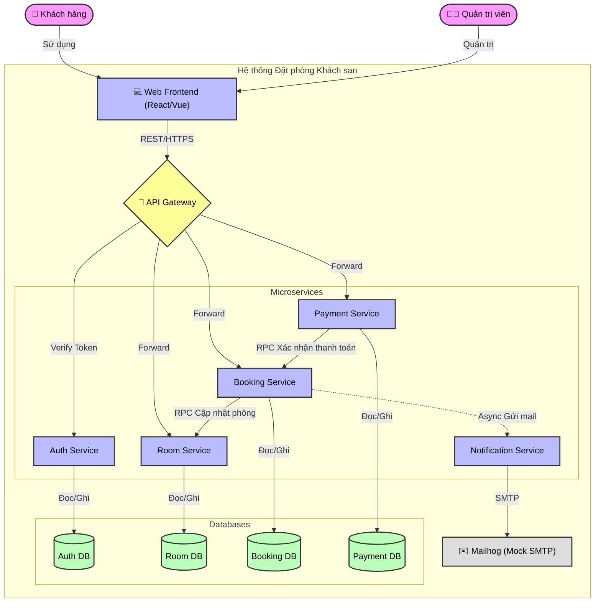
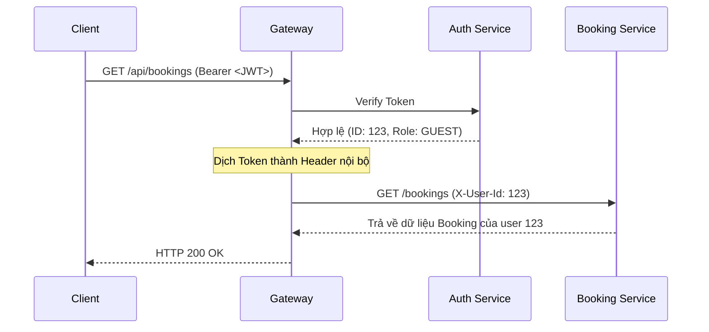
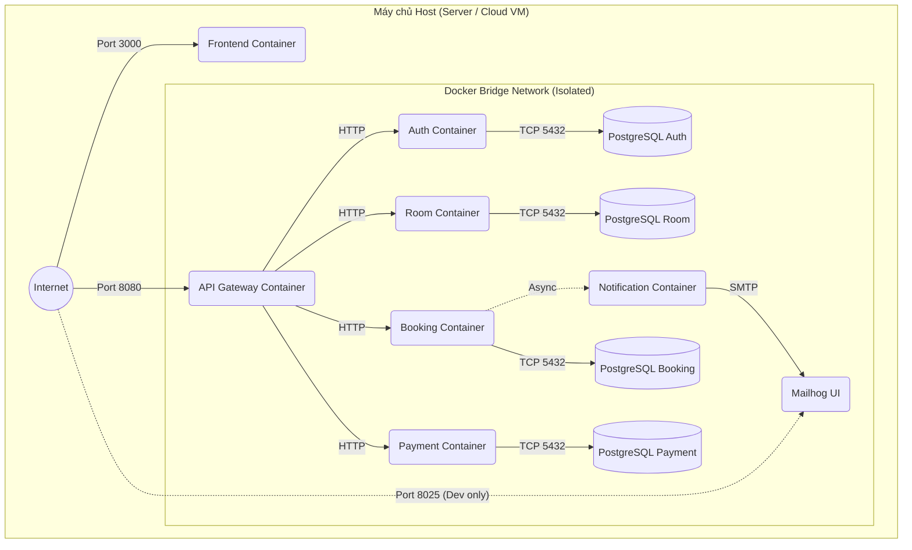

# 🏗️ In-Depth System Architecture — Hotel Booking Microservices

## 1. Executive Summary & Architectural Drivers

Hệ thống đặt phòng khách sạn trực tuyến được thiết kế theo kiến trúc **Microservices** nhằm giải quyết các hạn chế của hệ thống Monolithic (nguyên khối) truyền thống. Kiến trúc này mang lại khả năng mở rộng linh hoạt, cho phép từng nhóm phát triển (Team) triển khai độc lập các miền nghiệp vụ (Domain).

**Các yếu tố thúc đẩy kiến trúc (Architectural Drivers):**
- **Agility & Maintainability**: Phân tách ranh giới rõ ràng (Bounded Contexts) giúp code dễ bảo trì.
- **Scalability**: Khả năng scale up độc lập (VD: Dịch vụ Tìm phòng - Room Service thường chịu tải cao nhất, có thể scale gấp 3 lần dịch vụ Thanh toán).
- **Resilience (Khả năng chịu lỗi)**: Sự cố ở một module (VD: Gửi email thất bại) không được phép làm sập toàn bộ quy trình đặt phòng.
- **Security**: Xác thực tập trung và bảo mật luồng dữ liệu nội bộ.

---

## 2. Architectural Styles & Design Patterns

Hệ thống tuân thủ chặt chẽ các mẫu thiết kế (Patterns) phân tán hiện đại:

1. **Microservices Architecture**: Phân tách hệ thống thành 5 dịch vụ độc lập (Auth, Room, Booking, Payment, Notification).
2. **API Gateway Pattern**: Sử dụng một điểm vào duy nhất (Single Entrypoint) để ẩn đi độ phức tạp của mạng lưới microservices phía sau.
3. **Database-per-Service Pattern**: Mỗi Microservice sở hữu hoàn toàn một Database PostgreSQL vật lý riêng. Không có chuyện Service này query trực tiếp vào DB của Service khác.
4. **Saga Pattern (Orchestration)**: Đảm bảo tính nhất quán dữ liệu (Data Consistency) khi một giao dịch kinh doanh (Đặt phòng) trải dài qua nhiều services mà không thể dùng ACID Transaction.
5. **API Composition Pattern**: Frontend sẽ đóng vai trò tổng hợp dữ liệu từ nhiều nguồn (VD: Lấy thông tin phòng từ Room Service và trạng thái thanh toán từ Payment Service) thông qua Gateway.

---

## 3. High-Level Architecture Diagram (C4 Model - Container View)

---

## 4. Security Architecture (Identity Translation)

Thay vì yêu cầu mỗi Service phải tự mang thư viện giải mã JWT và gọi tới Auth Service liên tục (gây thắt cổ chai hiệu năng), kiến trúc áp dụng mô hình **Identity Translation tại Gateway**:

1. Client gửi Request kèm Header: `Authorization: Bearer <JWT>`.
2. API Gateway chặn Request lại, tự động giải mã JWT (hoặc gọi nội bộ sang Auth Service để verify).
3. Nếu JWT hợp lệ, Gateway **bóc tách (decode)** thông tin user và gắn vào Headers nội bộ:
   - `X-User-Id: 12345`
   - `X-User-Role: GUEST`
4. Gateway loại bỏ Header `Authorization` cũ và đẩy Request xuống các Services bên dưới.
5. Các Services (Room, Booking) nằm sâu trong mạng nội bộ (Private Network) sẽ **tin tưởng tuyệt đối** các Header `X-User-*` này và xử lý nghiệp vụ mà không cần xác thực lại.

---

## 5. Communication & Data Flow

Hệ thống kết hợp cả **Synchronous (Đồng bộ)** và **Asynchronous (Bất đồng bộ)** để tối ưu trải nghiệm.

### 5.1 Synchronous Communication (REST API)
Sử dụng RESTful API qua giao thức HTTP cho các thao tác yêu cầu phản hồi ngay lập tức:
- Gateway -> Microservices.
- Booking Service -> Room Service (Để kiểm tra phòng có thực sự trống ngay tại giây phút đặt hay không).

### 5.2 Asynchronous Communication
Dùng cho các tác vụ tốn thời gian, không ảnh hưởng đến luồng chính (Fire-and-forget):
- Cụ thể: Việc gửi Email thông báo. Khi Booking thành công, Booking Service chỉ việc ném ra một HTTP Async Request (hoặc đưa vào Message Queue nếu có) tới Notification Service, rồi lập tức trả kết quả cho Client, không cần chờ SMTP server thực sự gửi mail xong.

### 5.3 Ma trận giao tiếp (Inter-service Communication Matrix)

| Gọi Từ \ Gọi Tới | Auth | Room | Booking | Payment | Notification |
|------------------|------|------|---------|---------|--------------|
| **Gateway**      | Xác thực Token | REST (Forward) | REST (Forward) | REST (Forward) | - |
| **Booking**      | - | REST (Kiểm tra & Cập nhật trạng thái) | - | - | REST Async (Báo gửi Mail) |
| **Payment**      | - | - | REST (Webhook báo thanh toán OK) | - | - |

---

## 6. Service Internal Architecture (Kiến trúc bên trong Service)

Mỗi Microservice không viết code nguyên khối, mà tuân thủ **Layered Architecture (Kiến trúc phân lớp)**:
1. **Router / Controller Layer**: Tiếp nhận HTTP Request, validate tham số đầu vào.
2. **Service / Business Logic Layer**: Chứa toàn bộ logic nghiệp vụ (domain logic).
3. **Repository / Data Access Layer**: Chuyên biệt hóa việc tương tác với PostgreSQL (Dùng ORM như SQLAlchemy / Prisma).

*Nguyên tắc: Controller không được gọi thẳng DB, và Repository không chứa logic nghiệp vụ.*

---

## 7. Deployment & Infrastructure Architecture

Hệ thống được thiết kế hoàn toàn theo mô hình **Cloud-Native / Containerized**:

- **Dockerization**: Mọi thành phần (Code, Database, Mock Server) đều được đóng gói thành Docker Image. Đảm bảo tính nhất quán giữa môi trường Dev, Test và Production ("It works on my machine").
- **Docker Network**:
  - Tạo một mạng bridge riêng biệt (VD: `hotel_backend_net`).
  - Các DB Container hoàn toàn **cách ly khỏi Internet**, không map cổng (ports) ra máy host (Tránh rò rỉ dữ liệu).
  - Chỉ có container API Gateway và Frontend mới được map cổng (8080, 3000) ra ngoài Internet.
- **Service Discovery**: Dựa vào DNS nội bộ của Docker. Gateway muốn gọi Room Service chỉ cần gọi vào hostname `http://room-service:5002`.

### Biểu đồ Triển khai (Deployment Diagram)

---

## 8. Resilience & Scalability Strategy (Chiến lược Chịu lỗi và Mở rộng)

1. **Auto-Restart & Recovery**:
   - Sử dụng `restart: unless-stopped` trong cấu hình triển khai. Nếu một service bị crash do lỗi Memory/Code, Docker engine sẽ lập tức khởi động lại nó trong tích tắc.
2. **Stateless Services**:
   - Toàn bộ các service Backend đều được thiết kế phi trạng thái (Stateless). JWT không lưu trên RAM của server, dữ liệu phiên làm việc không tồn tại trên app.
   - Lợi ích: Có thể dễ dàng quay nhiều container (Scale out) của Room Service ra phía sau Load Balancer mà không lo mất đồng bộ.
3. **Data Consistency Handling (Saga)**:
   - Áp dụng các "Compensating Transactions" trong chuỗi cung ứng Đặt phòng để đảm bảo nếu hệ thống Payment lăn ra chết giữa chừng, Booking Service sẽ tự động liên hệ Room Service nhả lại phòng trống, ngăn chặn tình trạng "Phòng ảo".
4. **Health Checks**:
   - Tích hợp endpoint `/health` trả về `200 OK` để công cụ orchestration (Docker Swarm / Kubernetes sau này) biết container vẫn đang sống và sẵn sàng nhận traffic.
