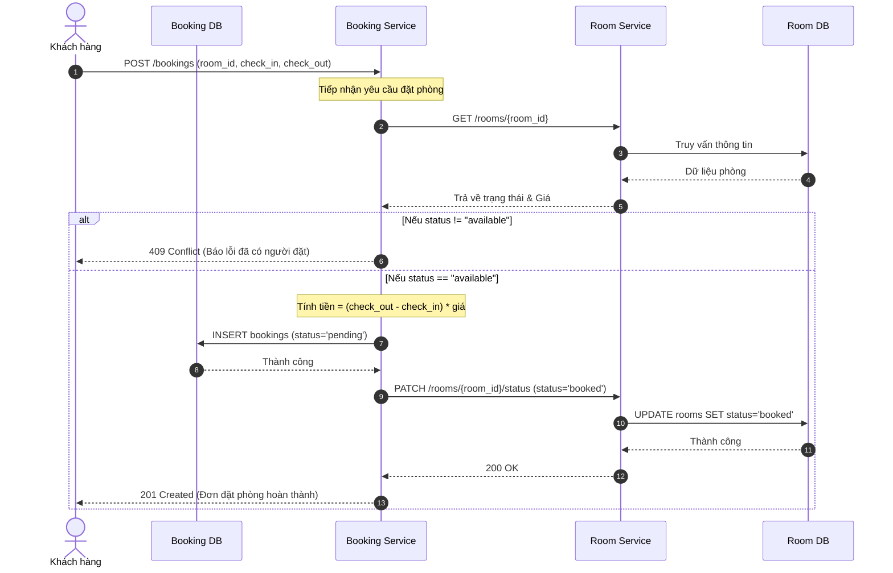

# 🏨 Booking Service (Service B - Quản lý đặt phòng)

**Người phụ trách:** Lê Bùi Anh Duy - B22DCVT101  
**Vai trò hệ thống:** Orchestrator (Điều phối viên) của quy trình Đặt phòng.

## 1. 🌟 Tổng quan (Overview)

**Booking Service** là vi dịch vụ cốt lõi trong hệ thống quản lý khách sạn. Nó chịu trách nhiệm chính trong việc xử lý các giao dịch đặt phòng của khách hàng. Do yêu cầu của mô hình Microservices phân tán (mỗi service 1 database riêng), Booking Service sử dụng **Saga Pattern** để đảm bảo tính nhất quán dữ liệu giữa Booking DB và Room DB.

**Dữ liệu quản lý (Data Ownership):**
- Danh sách các Đơn đặt phòng (Bookings).
- Trạng thái của đơn (Pending, Confirmed, Cancelled).
- Tổng chi phí lưu trú của đơn đặt.

## 2. 🛠️ Công nghệ sử dụng (Tech Stack)

| Component | Lựa chọn | Lý do |
| --- | --- | --- |
| **Language** | Python 3.10 | Cú pháp rõ ràng, triển khai nhanh. |
| **Framework** | FastAPI | Cung cấp sẵn Swagger UI, xử lý Asynchronous cực nhanh. |
| **Database** | PostgreSQL | RDBMS mạnh mẽ, hỗ trợ Transaction tốt. |
| **ORM** | SQLAlchemy | Truy vấn CSDL hướng đối tượng, an toàn chống SQL Injection. |

## 3. 🔄 Luồng Hoạt Động Cốt Lõi (Booking Workflow - Saga Pattern)

Để đảm bảo hai Database khác nhau đồng bộ dữ liệu (Khách đặt phòng xong thì phòng đó bên kia không ai được phép đặt nữa), hệ thống đã cài đặt **Saga Pattern (Choreography/Orchestration)**.

### Sơ đồ Tuần tự Đặt phòng (Booking Sequence Diagram)



### Diễn giải Chi Tiết:
1. **Tiếp nhận Yêu cầu:** `Booking Service` tiếp nhận thời gian Check-in, Check-out và mã phòng.
2. **Xác thực phòng (RPC Call):** Gọi ngay sang `Room Service` để kiểm tra phòng còn trống không. Nếu trống, lấy giá gốc.
3. **Tính toán & Khởi tạo (Pending):** Tính `Tổng tiền` và ghi nhận giao dịch vào cơ sở dữ liệu `Booking DB` với trạng thái chờ thanh toán (`pending`).
4. **Khóa Phòng (Saga Phase 1):** Gọi HTTP PATCH sang `Room Service` yêu cầu đổi cờ phòng thành `booked`. Điều này giúp không ai khác có thể vào "giành" phòng này nữa.

### Giao dịch Bồi hoàn (Compensating Transaction) khi Hủy Phòng
Nếu khách hàng hủy đặt phòng, hoặc không thanh toán kịp:
- Booking Service sẽ đổi trạng thái Đơn về `cancelled`.
- Nó sẽ gọi ngược lại Room Service yêu cầu trả phòng về lại trạng thái `available`.
- *(Đảm bảo không bao giờ bị dính lỗi "phòng ma" bị khóa mà không có người dùng).*

## 4. 🤝 Các Service Liên Quan (External Dependencies)

Trong kiến trúc Microservices, **Booking Service** không hoạt động cô lập mà đóng vai trò là nhạc trưởng (Orchestrator). Dưới đây là giải thích rõ ràng về các service liên quan và cách chúng phối hợp với Booking:

1. **Room Service (Dịch vụ Phòng):**
   - *Vai trò:* Cung cấp thông tin chi tiết về phòng (giá tiền, sức chứa) và bảo vệ quỹ phòng.
   - *Giao tiếp:* Booking Service gọi API `GET` để lấy giá phòng tính tiền, và gọi `PATCH` để yêu cầu Room Service "khóa phòng" (chuyển sang `booked`) hoặc "nhả phòng" (chuyển về `available` khi hủy).
   
2. **Payment Service (Dịch vụ Thanh toán):**
   - *Vai trò:* Xử lý giao dịch trừ tiền từ thẻ tín dụng/ví điện tử của khách hàng.
   - *Giao tiếp:* Sau khi khách hàng đặt phòng (trạng thái `pending`), Payment Service sẽ xử lý thanh toán. Nếu thanh toán thành công, Payment Service tự động gọi ngược lại API `PATCH /bookings/{id}/confirm` của Booking Service để đổi trạng thái đơn sang `confirmed`.

3. **Notification Service (Dịch vụ Thông báo):**
   - *Vai trò:* Gửi Email hóa đơn xác nhận cho khách hàng.
   - *Giao tiếp:* Giao tiếp bất đồng bộ (Asynchronous). Ngay khi đơn chuyển sang `confirmed`, Booking Service "bắn" một tín hiệu (Event) sang Notification Service rồi kết thúc công việc. Nó không cần đứng đợi Email được gửi đi thành công hay thất bại.

## 5. 🌐 Cổng Giao Tiếp (API Endpoints)

*(Đã được đính kèm CORS Middleware để Frontend có thể trực tiếp gọi).*

| Method | Endpoint | Authorization | Body Payload | Description |
|---|---|---|---|---|
| POST | `/bookings` | X-User-Id | `{room_id, check_in, check_out}` | Tạo giao dịch Đặt phòng (Saga trigger). |
| GET | `/bookings` | X-User-Id | N/A | Danh sách các đơn đặt phòng của User hiện tại. |
| PATCH | `/bookings/{id}/confirm`| Internal Only | `{payment_id}` | (Payment Service gọi) Xác nhận đã thanh toán. |
| PATCH | `/bookings/{id}/cancel` | X-User-Id | N/A | Hủy đơn đặt và Trả lại phòng (Saga rollback). |

> **Mẹo:** Khi chạy Project, bạn có thể xem Tài liệu cấu trúc API trực quan (Swagger UI) tại đường dẫn: `http://localhost:5003/docs`

## 5. 🚀 Hướng Dẫn Khởi Chạy (Running Locally)

**Chạy riêng lẻ bằng Docker (Từ thư mục gốc dự án):**
```bash
docker compose up -d db-booking db-room room-service booking-service
```

Sau khi chạy xong:
- **API của bạn** sẽ Live tại: `http://localhost:5003`
- **Swagger Documentation**: `http://localhost:5003/docs`

*(Bạn cũng có thể mở file `index.html` đính kèm ngoài thư mục gốc để trực tiếp Test giao diện luồng Đặt phòng này).*